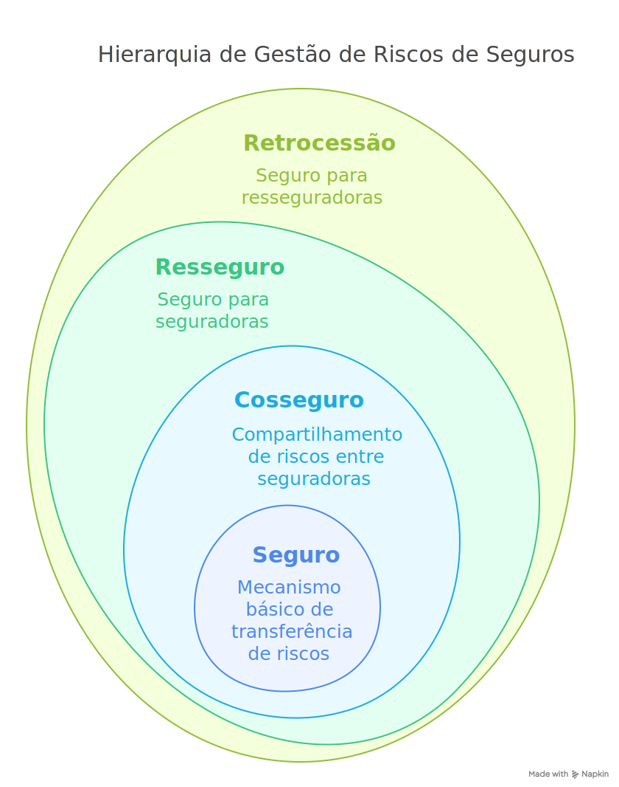

Em resumo, Seguro, Cosseguro, Resseguro e Retrocessão são mecanismos interligados de gestão e pulverização de riscos. O **Seguro** é a transferência direta do risco do segurado para uma seguradora mediante pagamento de prêmio. O **Cosseguro** é a divisão do mesmo risco entre várias seguradoras na apólice original. O **Resseguro** é o "seguro da seguradora", onde ela transfere parte dos riscos que assumiu para um ressegurador. A **Retrocessão** é o "seguro do ressegurador", onde este transfere parte dos riscos que aceitou em resseguro para outros resseguradores ou fundos especializados. Juntos, formam uma cadeia que garante a solvência do mercado e a capacidade de cobrir grandes sinistros.

<!-- truncate -->

## Índice Geral

### Questões Objetivas

* **CEBRASPE (CESPE)**
    * [Questão 1 (CEBRASPE - 2023 - AGU - Advogado da União) - Contrato de Seguro - Boa-fé](#q1-cebraspe-2023-agu)
    * [Questão 2 (CEBRASPE - 2022 - Banco Central - Analista) - Sistema Financeiro Nacional - Seguros](#q2-cebraspe-2022-bcb)
    * [Questão 3 (CEBRASPE - 2018 - AGU - Advogado da União) - Contrato de Seguro - Mora do Segurado](#q3-cebraspe-2018-agu)
    * [Questão 4 (CEBRASPE - 2015 - MPOG - Analista) - Seguro de Danos - Sub-rogação](#q4-cebraspe-2015-mpog)
    * [Questão 5 (CEBRASPE - 2013 - SUSEP - Analista) - Resseguro - Conceito e Finalidade](#q5-cebraspe-2013-susep)
    * [Questão 6 (CEBRASPE - 2013 - SUSEP - Analista) - Cosseguro vs. Resseguro](#q6-cebraspe-2013-susep)
    * [Questão 7 (CEBRASPE - 2010 - SUSEP - Analista) - Princípios do Seguro - Indenização](#q7-cebraspe-2010-susep)
    * [Questão 8 (CEBRASPE - 2010 - SUSEP - Analista) - Resseguro - Tipos](#q8-cebraspe-2010-susep)
    * [Questão 9 (CEBRASPE - 2022 - TCU - Auditor) - Contrato de Seguro - Elementos](#q9-cebraspe-2022-tcu)
    * [Questão 10 (CEBRASPE - 2019 - PG-DF - Procurador) - Seguro - Vício Intrínseco](#q10-cebraspe-2019-pgdf)
    * [Questão 11 (CEBRASPE - 2016 - TCE-PR - Analista) - Contrato de Seguro - Garantia e Prêmio](#q11-cebraspe-2016-tcepr)
    * [Questão 12 (CEBRASPE - 2014 - SUSEP - Analista - Adaptada) - Resseguro Não Proporcional](#q12-cebraspe-2014-susep-adapt)
    * [Questão 13 (CEBRASPE - 2010 - SUSEP - Analista) - Resseguro Obrigatório (Contexto da época)](#q13-cebraspe-2010-susep-obrig)
    * [Questão 14 (CEBRASPE - 2021 - SEFAZ-CE - Auditor) - Contrato de Seguro - Interpretação](#q14-cebraspe-2021-sefazce)
    * [Questão 15 (CEBRASPE - 2015 - STJ - Analista Judiciário) - Seguro Obrigatório (DPVAT)](#q15-cebraspe-2015-stj)
* **CESGRANRIO**
    * [Questão 16 (CESGRANRIO - 2023 - Banco do Brasil - Agente Comercial) - Produtos de Seguros](#q16-cesgranrio-2023-bb)
    * [Questão 17 (CESGRANRIO - 2018 - Banco da Amazônia - Técnico Bancário) - Noções de Seguros](#q17-cesgranrio-2018-basa)
    * [Questão 18 (CESGRANRIO - 2015 - Petrobras - Advogado Jr) - Contrato de Seguro - Código Civil](#q18-cesgranrio-2015-petrobras)
    * [Questão 19 (CESGRANRIO - 2014 - SUSEP - Analista - Adaptada) - Resseguro Proporcional](#q19-cesgranrio-2014-susep-adapt)
    * [Questão 20 (CESGRANRIO - 2012 - Caixa - Técnico Bancário) - Conceitos Básicos de Seguro](#q20-cesgranrio-2012-caixa)
    * [Questão 21 (CESGRANRIO - 2021 - Banco do Brasil - Agente de Tecnologia) - Seguros e Capitalização](#q21-cesgranrio-2021-bb-tec)
    * [Questão 22 (CESGRANRIO - 2016 - IBGE - Analista) - Contratos - Seguro](#q22-cesgranrio-2016-ibge)
* **FGV (Fundação Getulio Vargas)**
    * [Questão 23 (FGV - 2023 - Receita Federal - Auditor Fiscal) - Contrato de Seguro - Conceito](#q23-fgv-2023-rfb)
    * [Questão 24 (FGV - 2022 - SEFAZ-AM - Auditor Fiscal) - Contratos Empresariais - Seguro](#q24-fgv-2022-sefazam)
    * [Questão 25 (FGV - 2019 - TJ-CE - Analista Judiciário) - Contrato de Seguro - Características](#q25-fgv-2019-tjce)
    * [Questão 26 (FGV - 2017 - ALERJ - Especialista Legislativo) - Resseguro - Regulação (LC 126)](#q26-fgv-2017-alerj)
* **FCC (Fundação Carlos Chagas)**
    * [Questão 27 (FCC - 2022 - TRT-9 - Analista Judiciário) - Contrato de Seguro - Código Civil](#q27-fcc-2022-trt9)
    * [Questão 28 (FCC - 2019 - TJ-MA - Analista Judiciário) - Contrato de Seguro - Boa-fé](#q28-fcc-2019-tjma)
    * [Questão 29 (FCC - 2018 - TRT-6 - Analista Judiciário) - Seguro de Dano - Limite](#q29-fcc-2018-trt6)
    * [Questão 30 (FCC - 2017 - TCE-SP - Agente de Fiscalização) - Contrato de Seguro - Elementos](#q30-fcc-2017-tcesp)

### Questões Discursivas

* **CEBRASPE (CESPE)**
    * [Questão Discursiva 1 (CEBRASPE - 2010 - SUSEP - Analista - Adaptada) - Resseguro: Conceito, Finalidades e Modalidades](#dq1-cebraspe-2010-susep)
    * [Questão Discursiva 2 (CEBRASPE - 2013 - Banco Central - Procurador - Adaptada) - Princípios do Contrato de Seguro e Função Regulatória](#dq2-cebraspe-2013-bcb)
* **CESGRANRIO**
    * [Questão Discursiva 3 (CESGRANRIO - 2014 - SUSEP - Analista - Prova Simulada/Adaptada) - Diferenças entre Cosseguro, Resseguro e Seguro Cumulativo](#dq3-cesgranrio-2014-susep-simul)
    * [Questão Discursiva 4 (CESGRANRIO - 2018 - Petrobras - Advogado - Adaptada) - Elementos Essenciais do Contrato de Seguro e o Risco](#dq4-cesgranrio-2018-petrobras-adapt)

---

## Questões Objetivas

### CEBRASPE (CESPE)

**Questão 1 (CEBRASPE - 2023 - AGU - Advogado da União)**

No contrato de seguro, o princípio da boa-fé objetiva impõe deveres anexos às partes, mesmo após a extinção do contrato.
Acerca desse tema e de assuntos correlatos, julgue o item a seguir.

Em atenção ao princípio da boa-fé objetiva, é dever do segurado comunicar imediatamente ao segurador a ocorrência do
sinistro, sendo lícito, entretanto, que ele atenue ou deixe de evitar o dano, caso tal atitude configure ônus excessivo.

  

		( ) Certo
		( ) Errado

  

Clique para ver o gabarito comentado

**Explicação:**

A questão aborda o princípio da máxima boa-fé (uberriame fidei), mais especificamente os deveres do segurado após a
ocorrência do sinistro, conforme o Código Civil.

O Art. 771 do Código Civil estabelece: "Sob pena de perder o direito à indenização, o segurado participará o sinistro ao
segurador, logo que o saiba, e tomará as providências imediatas para minorar-lhe as consequências."

A primeira parte da afirmação está correta: o segurado deve comunicar o sinistro imediatamente.

A segunda parte, no entanto, está incorreta. O dever de mitigar os danos (salvamento) é uma obrigação do segurado
imposta pela lei e pelo princípio da boa-fé. Ele deve tomar as providências *imediatas* e *possíveis* para reduzir as
perdas. A lei não faculta ao segurado deixar de evitar o dano por considerar a atitude um "ônus excessivo" nesse
contexto genérico; ele tem o dever de agir na medida do razoável e possível. O descumprimento injustificado desse dever
pode levar à perda do direito à indenização ou à sua redução.

**Conceitos abordados:** Princípio da Máxima Boa-Fé, Deveres do Segurado, Aviso de Sinistro, Dever de Mitigação (
Salvamento - Art. 771 CC).

**Resposta Correta:** Errado

 

**Questão 2 (CEBRASPE - 2022 - Banco Central - Analista - Área: Infraestrutura e Logística - Adaptada)**

Julgue o item seguinte, a respeito de licitações e contratos administrativos, incluindo contratos de seguro no âmbito da
administração pública.

O contrato de seguro de responsabilidade civil facultativo contratado pela Administração Pública para cobrir danos
causados a terceiros em decorrência de obras públicas classifica-se como um seguro obrigatório devido ao interesse
público envolvido.

  

		( ) Certo
		( ) Errado

  

Clique para ver o gabarito comentado

**Explicação:**

A questão testa a distinção entre seguros facultativos e obrigatórios, aplicando ao contexto da Administração Pública.

Seguros obrigatórios são aqueles cuja contratação é imposta por lei (ex: DPVAT, RCTR-C). Seguros facultativos são
contratados por liberalidade das partes.

Embora a Administração Pública possa (e muitas vezes deva, por prudência ou exigência editalícia) contratar seguros de
responsabilidade civil para cobrir riscos de suas atividades (como obras), essa contratação, se não imposta por uma lei
específica para *aquele* seguro em *todas* as situações daquele tipo, permanece sendo de natureza facultativa. O fato de
haver interesse público na obra ou na proteção de terceiros não transforma, por si só, o seguro em obrigatório nos
termos da legislação securitária. A obrigatoriedade decorre de lei expressa que imponha o dever de contratar aquele
seguro específico. O seguro RC Obras geralmente é facultativo, embora possa ser uma exigência contratual em licitações.

**Conceitos abordados:** Seguros Obrigatórios vs. Facultativos, Contratos Administrativos, Seguro de Responsabilidade
Civil.

**Resposta Correta:** Errado

 

**Questão 3 (CEBRASPE - 2018 - AGU - Advogado da União)**

Com relação aos contratos de seguro, julgue o item subsequente.

A falta de pagamento do prêmio na data estipulada acarreta a resolução automática do contrato de seguro,
independentemente de qualquer notificação ao segurado.

  

		( ) Certo
		( ) Errado

  

Clique para ver o gabarito comentado

**Explicação:**

A questão trata das consequências da mora do segurado no pagamento do prêmio.

O Art. 763 do Código Civil dispõe: "Não terá direito a indenização o segurado que estiver em mora no pagamento do
prêmio, se ocorrer o sinistro antes de sua purgação."

A Súmula 616 do STJ estabelece: "A indenização securitária é devida quando ausente a comunicação prévia do segurado
acerca do atraso no pagamento do prêmio, por constituir requisito essencial para a suspensão ou resolução do contrato de
seguro."

Portanto, a mora no pagamento do prêmio não acarreta a resolução *automática* do contrato. A jurisprudência consolidada
exige a prévia notificação (interpelação) do segurado para constituí-lo em mora e possibilitar a suspensão da cobertura
ou eventual resolução do contrato. A simples falta de pagamento na data não extingue o contrato de pleno direito.

**Conceitos abordados:** Contrato de Seguro, Prêmio, Mora do Segurado, Resolução Contratual, Súmula 616 STJ, Boa-fé
Objetiva.

**Resposta Correta:** Errado

 

**Questão 4 (CEBRASPE - 2015 - MPOG - Analista Técnico-Administrativo)**

Julgue o item a seguir, relativo ao contrato de seguro.

Nos seguros de dano, o segurador que paga a indenização sub-roga-se, nos limites do valor respectivo, nos direitos e
ações que competirem ao segurado contra o autor do dano; essa sub-rogação, contudo, não tem lugar se o dano tiver sido
causado pelo cônjuge do segurado, por seus descendentes ou ascendentes, consanguíneos ou afins.

  

		( ) Certo
		( ) Errado

  

Clique para ver o gabarito comentado

**Explicação:**

A questão avalia o conhecimento sobre o princípio da sub-rogação no seguro de danos e suas exceções legais.

O Art. 786 do Código Civil estabelece a regra da sub-rogação: "Paga a indenização, o segurador sub-roga-se, nos limites
do valor respectivo, nos direitos e ações que competirem ao segurado contra o autor do dano."

O § 1º do mesmo artigo traz a exceção: "Salvo dolo, a sub-rogação não tem lugar se o dano foi causado pelo cônjuge do
segurado, seus descendentes ou ascendentes, consanguíneos ou afins."

A afirmação da questão reflete exatamente o conteúdo do Art. 786, caput e § 1º. A seguradora se sub-roga, mas essa
sub-rogação é afastada (exceto em caso de dolo) se o causador do dano for parente próximo do segurado, visando preservar
as relações familiares.

**Conceitos abordados:** Seguro de Dano, Princípio Indenitário, Sub-rogação (Art. 786 CC), Exceções à Sub-rogação.

**Resposta Correta:** Certo

 

**Questão 5 (CEBRASPE - 2013 - SUSEP - Analista Técnico - Conhecimentos Específicos)**

O resseguro pode ser conceituado como a operação de transferência de riscos de uma cedente para um ressegurador, com
vistas à proteção do seu patrimônio.

  

		( ) Certo
		( ) Errado

  

Clique para ver o gabarito comentado

**Explicação:**

A questão pede a validação de um conceito básico de resseguro.

Resseguro é, de fato, a operação pela qual uma seguradora (cedente) transfere a um ressegurador, total ou parcialmente,
os riscos assumidos em suas apólices de seguro. Uma das principais finalidades dessa transferência é proteger o
patrimônio da cedente contra perdas excessivas decorrentes de sinistros, garantindo sua solvência e capacidade de honrar
os compromissos com os segurados. O conceito apresentado está correto e alinhado com a definição padrão de resseguro.

**Conceitos abordados:** Resseguro (Conceito), Cedente, Ressegurador, Transferência de Risco, Finalidade do Resseguro (
Proteção Patrimonial, Solvência).

**Resposta Correta:** Certo

 

**Questão 6 (CEBRASPE - 2013 - SUSEP - Analista Técnico - Conhecimentos Específicos)**

No cosseguro, o segurado firma contratos com várias seguradoras, cada qual garantindo uma quota do risco. No resseguro,
ao contrário, o segurado firma contrato com apenas uma seguradora, que, por sua vez, repassa parte do risco a uma
resseguradora, com a qual o segurado não possui vínculo jurídico.

  

		( ) Certo
		( ) Errado

  

Clique para ver o gabarito comentado

**Explicação:**

A questão busca diferenciar cosseguro e resseguro, focando na relação contratual com o segurado.

A descrição do resseguro está correta: o segurado contrata com a seguradora (cedente), e esta contrata separadamente com
a resseguradora, sem vínculo direto, em regra, entre segurado e ressegurador.

A descrição do cosseguro, porém, contém uma imprecisão comum. Embora várias seguradoras participem, o mais comum é que o
segurado firme um *único contrato* (apólice), administrado por uma seguradora líder, no qual consta a participação (
quota) de cada cosseguradora. Todas as cosseguradoras têm vínculo jurídico *direto* com o segurado, respondendo pela sua
parte. A afirmação de que o segurado firma "contratos" (no plural, sugerindo contratos separados e independentes para
cada quota) não é a forma padrão e pode induzir a erro, embora o resultado prático da responsabilidade dividida seja
similar. A essência do cosseguro é a divisão do risco *na mesma operação original* com responsabilidade direta de todas
as envolvidas perante o segurado. A descrição feita, especialmente a parte sobre o vínculo jurídico no resseguro,
contrasta corretamente com o cosseguro, onde o vínculo é direto. Considerando o contraste e a essência da distinção, a
afirmação é predominantemente correta na diferenciação fundamental. No entanto, a descrição do cosseguro como "vários
contratos" pode ser vista como uma falha técnica dependendo da interpretação. A forma mais precisa seria "um único
contrato com várias seguradoras". Mas, o ponto central da distinção (vínculo segurado-ressegurador inexistente vs.
vínculo segurado-cosseguradora direto) está correto. Vamos considerar a intenção da banca em destacar a diferença de
vínculo.

*Revisão da análise*: A essência da questão está na diferença de vínculo. No Cosseguro, o segurado TEM vínculo direto
com TODAS as seguradoras participantes da apólice única (ou conjunto vinculado). No Resseguro, o segurado NÃO TEM
vínculo com o ressegurador. A descrição do resseguro está perfeita. A do cosseguro, ao dizer "firma contratos com várias
seguradoras", pode ser interpretada como uma imprecisão formal (geralmente é uma apólice), mas captura a ideia de que há
múltiplas seguradoras *diretamente* responsáveis perante o segurado por suas quotas. Dado o contexto de prova e a
clareza da distinção quanto ao vínculo, a afirmação é considerada correta pela maioria das interpretações em concursos.

**Conceitos abordados:** Cosseguro, Resseguro, Relação Contratual, Vínculo Jurídico, Seguradora Líder, Cedente.

**Resposta Correta:** Certo

 

**Questão 7 (CEBRASPE - 2010 - SUSEP - Analista Técnico - Conhecimentos Específicos)**

O princípio indenitário estabelece que a indenização não pode ultrapassar o valor do interesse segurado no momento do
sinistro nem o limite máximo da garantia fixado na apólice. Esse princípio não se aplica aos seguros de pessoas.

  

		( ) Certo
		( ) Errado

  

Clique para ver o gabarito comentado

**Explicação:**

A questão aborda o Princípio Indenitário e sua aplicabilidade.

O Princípio Indenitário é fundamental nos seguros de danos (coisas, patrimônio, responsabilidade civil). Ele visa
garantir que o seguro sirva para repor a perda econômica sofrida, evitando o enriquecimento sem causa do segurado. Por
isso, a indenização está limitada ao valor do prejuízo efetivo, respeitado o limite máximo da apólice (Art. 778 e 781 do
Código Civil).

Nos seguros de pessoas (vida, acidentes pessoais), a vida humana e a integridade física não têm valor econômico
mensurável para fins de "reposição". O valor da indenização (capital segurado) é estipulado livremente pelas partes no
momento da contratação e não se sujeita à comprovação do "prejuízo" nos mesmos moldes do seguro de danos. Portanto, o
princípio indenitário, em sua acepção estrita de limitar a indenização ao prejuízo material, não se aplica aos seguros
de pessoas (Art. 789 e 792 do Código Civil). A afirmação está correta.

**Conceitos abordados:** Princípio Indenitário, Seguro de Dano, Seguro de Pessoas, Limite Máximo de Indenização (LMI),
Valor do Interesse Segurado, Enriquecimento Sem Causa.

**Resposta Correta:** Certo

 

**Questão 8 (CEBRASPE - 2010 - SUSEP - Analista Técnico - Conhecimentos Específicos)**

O resseguro não proporcional, ou de excesso de danos (XoL), e o resseguro stop loss são modalidades de resseguro em que
o ressegurador participa com um percentual dos prejuízos apurados pela sociedade seguradora.

  

		( ) Certo
		( ) Errado

  

Clique para ver o gabarito comentado

**Explicação:**

A questão busca a característica definidora do resseguro não proporcional versus o proporcional.

No resseguro **proporcional** (Quota Parte, Excedente de Responsabilidade), o ressegurador e a cedente dividem prêmios e
sinistros segundo uma *proporção* ou *percentual* predefinido do risco original.

No resseguro **não proporcional** (Excesso de Danos - XoL, Stop Loss), a participação do ressegurador não é um
percentual fixo do risco ou do sinistro total. Ele só responde quando a perda (individual no XoL, ou agregada no Stop
Loss) *excede* um determinado valor (prioridade/franquia). A responsabilidade do ressegurador é pelo *excesso* da perda
acima da prioridade, até o limite da sua cobertura, e não um percentual *do total* do prejuízo.

Portanto, a afirmação de que no resseguro não proporcional (XoL e Stop Loss) o ressegurador participa com um "percentual
dos prejuízos" é incorreta. Essa característica (participação percentual) define o resseguro proporcional.

**Conceitos abordados:** Resseguro Proporcional, Resseguro Não Proporcional, Excesso de Danos (XoL), Stop Loss,
Prioridade (Franquia), Limite de Cobertura.

**Resposta Correta:** Errado

 

**Questão 9 (CEBRASPE - 2022 - TCU - Auditor Federal de Controle Externo)**

Considerando disposições do Código Civil acerca dos contratos em espécie, julgue o item a seguir.

No contrato de seguro, o risco e a garantia são elementos essenciais, sendo o primeiro o evento futuro e incerto cujos
efeitos são indenizáveis e a segunda, a obrigação de indenizar assumida pela seguradora.

  

		( ) Certo
		( ) Errado

  

Clique para ver o gabarito comentado

**Explicação:**

A questão verifica o conhecimento sobre os elementos essenciais do contrato de seguro.

O contrato de seguro possui elementos essenciais para sua validade e caracterização. Entre eles estão:

* **Interesse segurável:** O vínculo lícito entre o segurado e o bem/pessoa.
* **Risco:** O evento futuro, incerto, possível, lícito e independente da vontade exclusiva das partes, cuja ocorrência
  gera o prejuízo coberto. A definição dada ("evento futuro e incerto cujos efeitos são indenizáveis") está correta.
* **Prêmio:** A contraprestação paga pelo segurado.
* **Garantia:** A obrigação assumida pela seguradora de pagar a indenização ou capital segurado caso o risco se
  concretize (sinistro). A definição dada ("obrigação de indenizar assumida pela seguradora") está correta.

A afirmação identifica corretamente o risco e a garantia como elementos essenciais e os define adequadamente no contexto
do contrato de seguro.

**Conceitos abordados:** Elementos Essenciais do Contrato de Seguro, Risco, Garantia, Interesse Segurável, Prêmio.

**Resposta Correta:** Certo

 

**Questão 10 (CEBRASPE - 2019 - PG-DF - Procurador do Distrito Federal)**

À luz do entendimento do Superior Tribunal de Justiça (STJ) e das disposições do Código Civil sobre contratos, julgue o
item seguinte, a respeito de fiança, seguro e jogo e aposta.

O vício intrínseco da coisa segurada, como causa do sinistro, elide a responsabilidade da seguradora de indenizar o
segurado, salvo disposição contratual em contrário.

  

		( ) Certo
		( ) Errado

  

Clique para ver o gabarito comentado

**Explicação:**

A questão trata da exclusão de responsabilidade da seguradora em caso de vício intrínseco.

O Art. 784 do Código Civil estabelece: "Não se inclui na garantia o sinistro provocado por vício intrínseco da coisa
segurada, não declarado pelo segurado." O parágrafo único complementa: "Entende-se por vício intrínseco o defeito
próprio da coisa, que se não encontra normalmente em outras da mesma espécie."

A regra geral, portanto, é que o vício intrínseco *não declarado* exclui a cobertura. A questão afirma que o vício
intrínseco *como causa do sinistro* elide a responsabilidade, "salvo disposição contratual em contrário". Isso está
correto. A lei estabelece a exclusão como regra geral para vício não declarado, mas as partes podem, em tese, contratar
cobertura para certos vícios intrínsecos (embora seja raro e geralmente envolva prêmios mais altos ou condições
específicas). Além disso, a jurisprudência analisa se o vício era ou não de conhecimento do segurado e se foi
devidamente informado. A formulação da questão ("elide a responsabilidade (...) salvo disposição em contrário") está
alinhada com a ideia de que a exclusão por vício intrínseco não é absoluta e pode ser excepcionada contratualmente ou
por interpretação legal (se o vício não era oculto ou se foi declarado). A forma mais direta da lei (Art. 784) foca na
não declaração, mas a afirmação é compatível.

*Refinamento*: O STJ tem entendimentos que relativizam a exclusão se o vício não era de fácil constatação pelo segurado
leigo. Contudo, a regra base do CC e a possibilidade de disposição contratual diversa sustentam a assertiva como correta
no sentido de que o vício intrínseco é, *a princípio*, uma causa de exclusão de cobertura, passível de exceção
contratual.

**Conceitos abordados:** Contrato de Seguro, Riscos Cobertos, Riscos Excluídos, Vício Intrínseco (Art. 784 CC), Dever de
Informação.

**Resposta Correta:** Certo

 

**Questão 11 (CEBRASPE - 2016 - TCE-PR - Analista de Controle)**

Considerando o contrato de seguro, julgue o item a seguir.

O objeto principal do contrato de seguro é a garantia que o segurador oferece ao segurado, cobrindo os riscos
estabelecidos na apólice, mediante o pagamento de indenização em caso de sinistro. O prêmio, por sua vez, representa a
contraprestação paga pelo segurado.

  

		( ) Certo
		( ) Errado

  

Clique para ver o gabarito comentado

**Explicação:**

A questão conceitua os elementos "garantia" e "prêmio" no contrato de seguro.

* **Garantia:** É a obrigação fundamental assumida pela seguradora. Consiste em assumir o risco descrito na apólice e,
  caso ele se concretize (sinistro), pagar a indenização (seguro de dano) ou o capital/renda (seguro de pessoa) ao
  segurado ou beneficiário. A descrição na questão está correta.
* **Prêmio:** É o valor pago pelo segurado à seguradora como contraprestação pela assunção do risco e pela garantia
  oferecida. É o "preço" do seguro. A descrição na questão também está correta.

A afirmação define adequadamente os papéis da garantia (obrigação do segurador) e do prêmio (obrigação do segurado) como
elementos centrais do contrato de seguro.

**Conceitos abordados:** Elementos Essenciais do Contrato de Seguro, Garantia, Risco, Prêmio, Indenização, Sinistro.

**Resposta Correta:** Certo

 

**Questão 12 (CEBRASPE - 2014 - SUSEP - Analista - Adaptada a partir de conceitos gerais de prova similar)**

Julgue o item a seguir, acerca das modalidades de resseguro.

No resseguro de Excesso de Danos (XoL) por Risco, o ressegurador garante à cedente o reembolso de parte das indenizações
pagas em um determinado período, sempre que a sinistralidade total da carteira ultrapassar um percentual pré-definido
dos prêmios ganhos.

  

		( ) Certo
		( ) Errado

  

Clique para ver o gabarito comentado

**Explicação:**

A questão descreve uma modalidade de resseguro não proporcional e a atribui ao "Excesso de Danos (XoL) por Risco".

O **Excesso de Danos (XoL) por Risco (Per Risk XL)** protege a seguradora contra a severidade de um sinistro que afeta
*um único risco* (uma apólice, um bem segurado). O ressegurador paga a parte da perda *daquele sinistro específico* que
excede a prioridade da cedente.

A descrição fornecida na questão ("reembolso (...) sempre que a sinistralidade *total da carteira* ultrapassar um
*percentual pré-definido dos prêmios ganhos*") não corresponde ao XoL por Risco. Essa descrição define, na verdade, o
resseguro **Stop Loss (ou Excesso de Sinistralidade)**, que protege contra a frequência e severidade *agregadas* da
carteira durante um período.

Portanto, a questão atribui a definição do Stop Loss à modalidade XoL por Risco, tornando a afirmação incorreta.

**Conceitos abordados:** Resseguro Não Proporcional, Excesso de Danos (XoL) por Risco (Per Risk XL), Stop Loss (Excesso
de Sinistralidade), Sinistralidade Agregada, Prioridade, Prêmio Ganho.

**Resposta Correta:** Errado

 

**Questão 13 (CEBRASPE - 2010 - SUSEP - Analista Técnico - Conhecimentos Específicos - Contexto da época)**

*Nota: Esta questão reflete a legislação ANTERIOR à Lei Complementar 126/2007, que reabriu o mercado de resseguros, mas
o conceito de cessão obrigatória ainda pode ser explorado em termos históricos ou comparativos.*

Considerando a legislação que regia o resseguro no Brasil antes da abertura do mercado, o ressegurador monopolista
detinha o direito de aceitar ou recusar as cessões que lhe eram oferecidas pelas seguradoras, caracterizando uma
operação facultativa para o ressegurador.

  

		( ) Certo
		( ) Errado

  

Clique para ver o gabarito comentado

**Explicação:**

A questão aborda o regime de resseguro no Brasil durante o monopólio do IRB (Instituto de Resseguros do Brasil), que
vigorou até a LC 126/2007.

Durante o monopólio, as seguradoras eram *obrigadas* a ceder ao IRB uma parte significativa dos riscos que subscreviam (
cessão legal obrigatória). Embora o IRB tivesse capacidade técnica para analisar os riscos, a natureza da operação era
predominantemente de aceitação obrigatória para o IRB dentro dos limites e condições estabelecidos na regulação da
época. A ideia de uma recusa generalizada ou de uma operação puramente facultativa *para o ressegurador monopolista* no
que diz respeito às cessões legais não condiz com a estrutura do monopólio, cujo objetivo era justamente concentrar e
redistribuir compulsoriamente o risco no mercado nacional sob controle estatal. Havia mecanismos de ajuste e negociação,
mas a base era a cessão e aceitação compulsórias de grande parte do mercado.

Portanto, afirmar que o ressegurador monopolista tinha ampla faculdade de aceitar ou recusar as cessões obrigatórias não
reflete a característica principal daquele sistema.

**Conceitos abordados:** História do Resseguro no Brasil, Monopólio do IRB, Cessão Obrigatória, Resseguro Facultativo
vs. Automático/Obrigatório (Contexto Histórico), LC 126/2007 (Marco da Reabertura).

**Resposta Correta:** Errado

 

**Questão 14 (CEBRASPE - 2021 - SEFAZ-CE - Auditor Fiscal Contábil-Financeiro da Receita Estadual)**

No que se refere aos contratos de seguro e de fiança, julgue o item a seguir.

Por se tratar de contrato de adesão, as cláusulas do contrato de seguro devem ser interpretadas de maneira mais
favorável ao aderente em caso de ambiguidade ou contradição.

  

		( ) Certo
		( ) Errado

  

Clique para ver o gabarito comentado

**Explicação:**

A questão trata da interpretação das cláusulas em contratos de seguro, relacionando-a à sua natureza de contrato de
adesão.

O contrato de seguro é tipicamente um contrato de adesão, no qual as cláusulas são pré-redigidas pela seguradora (
proponente) e o segurado (aderente) simplesmente concorda com elas, sem grande margem para negociação individual das
condições gerais.

Tanto o Código Civil (Art. 423) quanto o Código de Defesa do Consumidor (Art. 47), aplicável aos contratos de seguro,
estabelecem que, nos contratos de adesão, as cláusulas ambíguas ou contraditórias devem ser interpretadas da maneira
mais favorável ao aderente (no caso, o segurado). Esta é uma regra de proteção à parte considerada mais vulnerável na
relação contratual.

Portanto, a afirmação está correta.

**Conceitos abordados:** Contrato de Seguro, Contrato de Adesão, Interpretação Contratual, Código Civil (Art. 423),
Código de Defesa do Consumidor (Art. 47), Princípio da Interpretação Mais Favorável ao Aderente (in dubio pro
aderente/consumidor).

**Resposta Correta:** Certo

 

**Questão 15 (CEBRASPE - 2015 - STJ - Analista Judiciário - Área Judiciária)**

A respeito dos contratos de seguro, julgue o item que se segue.

O seguro obrigatório de danos pessoais causados por veículos automotores de via terrestre (DPVAT) possui natureza de
seguro de responsabilidade civil, pois visa cobrir danos causados a terceiros.

  

		( ) Certo
		( ) Errado

  

Clique para ver o gabarito comentado

**Explicação:**

A questão analisa a natureza jurídica do seguro DPVAT.

O DPVAT (Danos Pessoais Causados por Veículos Automotores de Via Terrestre) cobre indenizações por morte, invalidez
permanente e despesas médicas e suplementares (DAMS) sofridas por *pessoas* (vítimas de acidentes de trânsito, sejam
motoristas, passageiros ou pedestres), independentemente de apuração de culpa.

Seguro de Responsabilidade Civil (RC) visa cobrir a obrigação de indenizar do segurado perante *terceiros* pelos danos
que ele *causou* e pelos quais foi responsabilizado.

O DPVAT não é um seguro de RC. Ele indeniza a *vítima* diretamente pelos danos pessoais sofridos, sem perquirir culpa do
motorista ou proprietário do veículo. Ele se assemelha mais a um seguro de acidentes pessoais *sui generis*, de caráter
social e obrigatório. Embora proteja terceiros (vítimas), não o faz cobrindo a *responsabilidade* do causador do dano,
mas sim indenizando a própria vítima diretamente pelo dano pessoal.

Portanto, classificar o DPVAT como seguro de responsabilidade civil é incorreto.

**Conceitos abordados:** Seguro Obrigatório, DPVAT, Seguro de Danos Pessoais, Seguro de Responsabilidade Civil, Natureza
Jurídica do Seguro.

**Resposta Correta:** Errado

 

### CESGRANRIO

**Questão 16 (CESGRANRIO - 2023 - Banco do Brasil - Agente Comercial)**

Os seguros são contratos que visam a proteger pessoas e patrimônios de possíveis riscos futuros. Existem diversas
modalidades de seguros, cada uma com suas especificidades. Uma modalidade que garante o pagamento de uma indenização ao
próprio segurado ou aos seus beneficiários, em caso de morte ou invalidez, é o seguro de

  

		(A) vida
		(B) automóvel
		(C) incêndio
		(D) responsabilidade civil
		(E) lucros cessantes

  

Clique para ver o gabarito comentado

**Explicação:**

A questão pede para identificar a modalidade de seguro que cobre os eventos de morte e invalidez, pagando indenização ao
segurado ou beneficiários.

* **(A) vida:** Cobre especificamente os riscos de morte e, frequentemente, invalidez (por acidente ou doença) e
  sobrevivência, pagando um capital segurado aos beneficiários ou ao próprio segurado. Esta é a descrição correta.
* **(B) automóvel:** Cobre danos ao veículo (casco), roubo/furto e danos a terceiros (RC Facultativo de Veículos -
  RCF-V), mas não primariamente morte/invalidez do segurado como risco principal (embora possa ter coberturas acessórias
  de Acidentes Pessoais de Passageiros - APP).
* **(C) incêndio:** Cobre danos materiais ao imóvel ou conteúdo causados por incêndio, raio ou explosão.
* **(D) responsabilidade civil:** Cobre a obrigação do segurado de indenizar terceiros por danos involuntários causados
  por ele.
* **(E) lucros cessantes:** Cobre a perda de receita ou lucro de uma empresa devido à paralisação de suas atividades por
  um sinistro coberto (geralmente acessória a um seguro patrimonial).

A descrição corresponde diretamente ao seguro de vida.

**Conceitos abordados:** Modalidades de Seguro, Seguro de Pessoas, Seguro de Vida, Seguro de Danos (Automóvel, Incêndio,
RC, Lucros Cessantes).

**Resposta Correta:** A

 

**Questão 17 (CESGRANRIO - 2018 - Banco da Amazônia - Técnico Bancário)**

No contexto dos contratos de seguro, o valor que o segurado paga à seguradora para ter direito à cobertura é denominado

  

		(A) sinistro
		(B) apólice
		(C) franquia
		(D) prêmio
		(E) indenização

  

Clique para ver o gabarito comentado

**Explicação:**

A questão pede o nome do valor pago pelo segurado à seguradora.

* **(A) sinistro:** É a ocorrência do risco previsto no contrato, que gera o dever de indenizar.
* **(B) apólice:** É o documento que formaliza o contrato de seguro, contendo as condições gerais, especiais e
  particulares.
* **(C) franquia:** É a participação obrigatória do segurado nos prejuízos em caso de sinistro (comum em seguros de
  danos, como automóvel).
* **(D) prêmio:** É o preço do seguro, o valor pago pelo segurado à seguradora para transferir o risco e obter a
  garantia. Esta é a resposta correta.
* **(E) indenização:** É o valor pago pela seguradora ao segurado ou beneficiário em caso de sinistro, para reparar o
  dano ou pagar o capital segurado.

**Conceitos abordados:** Elementos Essenciais do Contrato de Seguro, Prêmio, Sinistro, Apólice, Franquia, Indenização.

**Resposta Correta:** D

 

**Questão 18 (CESGRANRIO - 2015 - Petrobras - Advogado Jr)**

Segundo o Código Civil brasileiro, no contrato de seguro, a garantia prometida

  

		(A) pode abranger todos os riscos, exceto os decorrentes de atos praticados pelo próprio segurado.
		(B) fica restrita aos riscos predeterminados na apólice, excluindo-se os resultantes de vício intrínseco da coisa segurada não declarado pelo segurado.
		(C) é devida mesmo que o segurado agrave intencionalmente o risco objeto do contrato.
		(D) obriga a seguradora a pagar em dobro a indenização se o sinistro ocorrer por culpa de terceiro.
		(E) se estende aos danos causados por caso fortuito ou força maior, mesmo que haja cláusula expressa em contrário.

  

Clique para ver o gabarito comentado

**Explicação:**

A questão avalia o conhecimento sobre a extensão da garantia no contrato de seguro, conforme o Código Civil.

* **(A) Incorreta.** A garantia pode abranger riscos decorrentes de atos do segurado, *desde que não sejam intencionais
  ou de má-fé* para provocar o sinistro. A culpa grave do segurado pode, em alguns casos, excluir a indenização, mas nem
  todo ato do segurado exclui (ex: simples negligência pode ser coberta). Atos dolosos são excluídos (Art. 768 CC).
* **(B) Correta.** A garantia é restrita aos riscos *previstos* na apólice (Art. 757 CC). Além disso, o Art. 784 CC
  exclui da garantia o sinistro provocado por vício intrínseco da cosa segurada *não declarado* pelo segurado. Esta
  alternativa combina essas duas regras importantes.
* **(C) Incorreta.** O segurado perde o direito à garantia se agravar intencionalmente o risco objeto do contrato (Art.
  768 CC).
* **(D) Incorreta.** Não existe previsão legal para pagamento em dobro nessas circunstâncias. A seguradora paga a
  indenização devida nos termos da apólice e depois pode se sub-rogar contra o terceiro culpado (Art. 786 CC).
* **(E) Incorreta.** Caso fortuito e força maior são riscos geralmente cobertos, *a menos que* haja cláusula expressa de
  exclusão na apólice (Art. 776 CC permite exclusões, desde que não abusivas). A apólice delimita os riscos.

**Conceitos abordados:** Contrato de Seguro, Garantia, Riscos Cobertos, Riscos Excluídos, Agravamento do Risco (Art. 768
CC), Vício Intrínseco (Art. 784 CC), Sub-rogação (Art. 786 CC), Caso Fortuito/Força Maior.

**Resposta Correta:** B

 

**Questão 19 (CESGRANRIO - 2014 - SUSEP - Analista - Adaptada a partir de conceitos gerais de prova similar)**

Uma seguradora estabelece um contrato de resseguro no qual se compromete a ceder 20% de todos os prêmios e sinistros de
sua carteira de seguros de transporte marítimo a um ressegurador. Esse tipo de contrato é classificado como

  

		(A) Resseguro Facultativo
		(B) Resseguro de Excedente de Responsabilidade
		(C) Resseguro de Quota Parte
		(D) Resseguro Stop Loss
		(E) Resseguro de Excesso de Danos (XoL)

  

Clique para ver o gabarito comentado

**Explicação:**

A questão descreve uma situação de resseguro e pede sua classificação. A característica chave é a cessão de um
*percentual fixo* (20%) de *todos* os prêmios e sinistros de uma carteira específica (transporte marítimo).

* **(A) Resseguro Facultativo:** É negociado caso a caso, risco a risco, não para uma carteira inteira com percentual
  fixo.
* **(B) Resseguro de Excedente de Responsabilidade:** A seguradora retém um valor fixo (linha) e cede o excedente. A
  proporção cedida varia a cada apólice, não é um percentual fixo de toda a carteira.
* **(C) Resseguro de Quota Parte:** O ressegurador assume um percentual fixo de *todos* os riscos (e consequentemente
  prêmios e sinistros) de uma determinada carteira ou ramo. Corresponde exatamente à descrição da questão.
* **(D) Resseguro Stop Loss:** Cobre a sinistralidade agregada da carteira que excede um percentual dos prêmios, não um
  percentual fixo de cada prêmio/sinistro.
* **(E) Resseguro de Excesso de Danos (XoL):** Cobre a parte de um sinistro que excede uma franquia (prioridade), não um
  percentual fixo.

**Conceitos abordados:** Tipos de Resseguro, Resseguro Proporcional, Resseguro de Quota Parte, Resseguro de Excedente de
Responsabilidade, Resseguro Não Proporcional, Resseguro Facultativo.

**Resposta Correta:** C

 

**Questão 20 (CESGRANRIO - 2012 - Caixa Econômica Federal - Técnico Bancário)**

O contrato de seguro é um acordo de vontades em que uma das partes, o segurador, mediante o recebimento de um pagamento,
chamado prêmio, obriga-se a indenizar a outra parte, o segurado, ou terceiro beneficiário, por prejuízos resultantes de
riscos futuros, previstos no contrato. O evento futuro e incerto, previsto no contrato, que pode gerar o prejuízo
indenizável, é conhecido como

  

		(A) prêmio
		(B) risco
		(C) apólice
		(D) franquia
		(E) capital segurado

  

Clique para ver o gabarito comentado

**Explicação:**

A questão fornece a definição de contrato de seguro e pede o nome do elemento "evento futuro e incerto".

* **(A) prêmio:** É o pagamento feito pelo segurado.
* **(B) risco:** É o evento futuro, incerto, possível e de consequências danosas, cuja ocorrência aciona a cobertura do
  seguro. Corresponde à definição dada.
* **(C) apólice:** É o documento contratual.
* **(D) franquia:** É a participação do segurado no prejuízo.
* **(E) capital segurado:** É o valor máximo da indenização, especialmente em seguros de pessoas ou no limite da apólice
  de danos.

**Conceitos abordados:** Elementos Essenciais do Contrato de Seguro, Risco, Prêmio, Apólice, Franquia, Capital
Segurado/Indenização.

**Resposta Correta:** B

 

**Questão 21 (CESGRANRIO - 2021 - Banco do Brasil - Agente de Tecnologia)**

No mercado financeiro e de capitais, diversos produtos são oferecidos. Um desses produtos financeiros permite a
acumulação de recursos por um prazo determinado, combinando características de seguro e investimento, e frequentemente
inclui sorteios. Esse produto é conhecido como

  

		(A) Ações
		(B) Debêntures
		(C) Fundos de Investimento
		(D) Título de Capitalização
		(E) Certificado de Depósito Bancário (CDB)

  

Clique para ver o gabarito comentado

**Explicação:**

Embora a questão não trate diretamente dos conceitos centrais de seguro/resseguro, ela aborda um produto correlato
frequentemente supervisionado pela SUSEP e que pode gerar confusão: a Capitalização. A descrição (acumulação, prazo,
sorteios, combinação com seguro) se encaixa perfeitamente na definição de Título de Capitalização.

* (A) Ações: Representam participação no capital de empresas.
* (B) Debêntures: Títulos de dívida emitidos por empresas.
* (C) Fundos de Investimento: Condomínios de investidores para aplicação em carteira diversificada.
* (D) Título de Capitalização: Produto que combina guarda de dinheiro com sorteios e, às vezes, elementos de seguro (
  pecúlio). Regulado pela SUSEP.
* (E) CDB: Título de renda fixa emitido por bancos.

**Conceitos abordados:** Produtos Financeiros, Título de Capitalização, Mercado Supervisionado pela SUSEP (Seguros,
Previdência Aberta, Capitalização, Resseguro). *Relevância para SUSEP: Conhecer os produtos sob sua supervisão.*

**Resposta Correta:** D

 

**Questão 22 (CESGRANRIO - 2016 - IBGE - Analista Censitário - Ciências Contábeis)**

O contrato de seguro personalíssimo é aquele que

  

		(A) não admite sub-rogação em favor da seguradora.
		(B) não pode ser objeto de cessão ou transferência a terceiros.
		(C) possui prazo indeterminado de vigência.
		(D) tem como objeto exclusivo a cobertura de riscos sobre bens imóveis.
		(E) exige a presença de um fiador para garantir o pagamento do prêmio.

  

Clique para ver o gabarito comentado

**Explicação:**

A questão pergunta sobre a característica de um contrato de seguro "personalíssimo" (intuitu personae). Embora o seguro
padrão não seja estritamente personalíssimo (a apólice pode ser transferida com o bem em alguns casos, como venda de
veículo), alguns seguros têm forte caráter pessoal, e a característica *intuitu personae* se refere à impossibilidade de
transferência da posição contratual sem anuência da outra parte, devido às qualidades pessoais do contratante original
serem relevantes.

* (A) Incorreta. A sub-rogação é típica do seguro de dano, não diretamente ligada ao caráter personalíssimo. Seguros de
  RC, por exemplo, podem ter elemento pessoal mas admitem sub-rogação.
* **(B) Correta.** A característica essencial de um contrato personalíssimo (ou *intuitu personae*) é que ele é
  celebrado em função das qualidades pessoais de uma das partes, não podendo ser transferido ou cedido a outrem sem o
  consentimento da contraparte. No seguro, a avaliação do risco leva em conta características do segurado.
* (C) Incorreta. Contratos de seguro geralmente têm prazo determinado.
* (D) Incorreta. O caráter personalíssimo não se liga ao tipo de bem, mas à pessoa do contratante.
* (E) Incorreta. A figura do fiador não é elemento típico ou necessário do contrato de seguro.

**Conceitos abordados:** Natureza do Contrato de Seguro, Contrato Personalíssimo (*intuitu personae*), Cessão de
Contrato, Transferência de Apólice.

**Resposta Correta:** B

 

### FGV (Fundação Getulio Vargas)

**Questão 23 (FGV - 2023 - Receita Federal do Brasil - Auditor Fiscal)**

O contrato pelo qual alguém (segurador) se obriga, mediante o pagamento de um prêmio, a garantir interesse legítimo de
outrem (segurado), relativo a pessoa ou a coisa, contra riscos predeterminados, é o contrato de:

  

		(A) fiança;
		(B) depósito;
		(C) seguro;
		(D) agência;
		(E) comissão.

  

Clique para ver o gabarito comentado

**Explicação:**

A questão fornece a definição legal e doutrinária clássica do contrato de seguro, conforme o Art. 757 do Código Civil: "
Pelo contrato de seguro, o segurador se obriga, mediante o pagamento do prêmio, a garantir interesse legítimo do
segurado, relativo a pessoa ou a coisa, contra riscos predeterminados."

As demais opções são:

* (A) Fiança: Garantia pessoal dada por terceiro para cumprimento de obrigação.
* (B) Depósito: Contrato de guarda de coisa alheia.
* (D) Agência: Contrato de promoção de negócios por conta de outrem em zona determinada.
* (E) Comissão: Contrato de realização de negócios em nome próprio, mas por conta de outrem.

A definição corresponde exatamente ao contrato de seguro.

**Conceitos abordados:** Contrato de Seguro (Definição Legal - Art. 757 CC), Elementos (Segurador, Segurado, Prêmio,
Interesse Legítimo, Risco Predeterminado).

**Resposta Correta:** C

 

**Questão 24 (FGV - 2022 - SEFAZ-AM - Auditor Fiscal de Tributos Estaduais)**

No contrato de seguro de dano, a garantia prometida não pode ultrapassar o valor do interesse segurado no momento da
conclusão do contrato. Este postulado decorre diretamente do princípio:

  

		(A) da boa-fé objetiva;
		(B) do mutualismo;
		(C) indenitário;
		(D) da função social do contrato;
		(E) da relatividade dos efeitos contratuais.

  

Clique para ver o gabarito comentado

**Explicação:**

A questão descreve uma das regras fundamentais do seguro de dano: a limitação da garantia ao valor do interesse
segurado (além do limite da apólice), e pergunta qual princípio rege essa regra.

* (A) Boa-fé objetiva: É crucial, mas rege a conduta das partes em todas as fases.
* (B) Mutualismo: É a base da operação (distribuição de riscos), mas não explica diretamente a limitação do valor.
* **(C) Indenitário:** É o princípio que estabelece que o seguro de dano visa *indenizar* a perda, *recompor* o
  patrimônio, e não gerar lucro. Limitar a garantia ao valor do interesse (e a indenização ao prejuízo efetivo) é a
  expressão máxima desse princípio, evitando o enriquecimento sem causa (Art. 778 e 781 CC).
* (D) Função social: Orienta a interpretação e aplicação dos contratos em benefício da coletividade, mas o princípio
  específico da limitação é o indenitário.
* (E) Relatividade: Diz que o contrato gera efeitos, em regra, apenas entre as partes.

A limitação da garantia ao valor do interesse é a aplicação direta do princípio indenitário.

**Conceitos abordados:** Seguro de Dano, Princípio Indenitário, Valor do Interesse Segurado, Limite da Garantia,
Enriquecimento Sem Causa.

**Resposta Correta:** C

 

**Questão 25 (FGV - 2019 - TJ-CE - Analista Judiciário - Área Judiciária)**

O contrato de seguro possui natureza jurídica complexa, sendo classificado como:

  

		(A) unilateral, gratuito e comutativo;
		(B) bilateral, oneroso e aleatório;
		(C) plurilateral, gratuito e aleatório;
		(D) bilateral, oneroso e comutativo;
		(E) unilateral, oneroso e aleatório.

  

Clique para ver o gabarito comentado

**Explicação:**

A questão pede a classificação do contrato de seguro quanto à sua natureza jurídica.

* **Bilateral:** Gera obrigações para ambas as partes (segurado paga prêmio, seguradora garante e indeniza se houver
  sinistro). (Descarta A, C, E)
* **Oneroso:** Ambas as partes buscam vantagem patrimonial (segurado busca proteção/indenização, seguradora busca
  lucro/resultado técnico pela gestão do mutualismo). (Mantém B e D, descarta A e C)
* **Aleatório:** A principal obrigação da seguradora (indenizar) depende de um evento futuro e incerto (sinistro). A
  existência e a extensão da prestação da seguradora são incertas no momento da contratação. (Mantém B, descarta D, que
  o classifica como comutativo - onde as prestações são certas e equivalentes desde o início).

Portanto, o contrato de seguro é bilateral, oneroso e aleatório.

**Conceitos abordados:** Classificação dos Contratos, Contrato Bilateral, Contrato Oneroso, Contrato Aleatório, Contrato
Comutativo, Natureza Jurídica do Seguro.

**Resposta Correta:** B

 

**Questão 26 (FGV - 2017 - ALERJ - Especialista Legislativo - Direito)**

A Lei Complementar nº 126/2007 dispôs sobre a política de resseguro, retrocessão e sua intermediação, encerrando o
monopólio até então existente no setor. Conforme essa legislação, a contratação de resseguro:

  

		(A) é obrigatória para todas as seguradoras em todos os ramos, visando garantir a solvência do mercado.
		(B) pode ser realizada livremente com resseguradores estrangeiros, sem qualquer restrição ou preferência para resseguradores locais.
		(C) deve observar a preferência pela contratação de resseguradores locais em igualdade de condições com propostas estrangeiras, conforme regulamentação.
		(D) só pode ser feita na modalidade facultativa, tendo sido extintos os contratos automáticos para aumentar a supervisão da SUSEP.
		(E) passou a ser intermediada exclusivamente pelo IRB-Brasil Resseguros S.A., que atua como corretor oficial.

  

Clique para ver o gabarito comentado

**Explicação:**

A questão aborda a regulação do resseguro após a LC 126/2007 (abertura do mercado).

* (A) Incorreta. A contratação de resseguro não é obrigatória em todos os casos, depende da política de gestão de riscos
  da seguradora e de sua capacidade de retenção, embora seja prática comum e necessária para grandes riscos ou gestão de
  carteira.
* (B) Incorreta. A LC 126/2007 e sua regulamentação (especialmente em sua versão original e primeiras alterações)
  estabeleceram regras de preferência para resseguradores locais e outras restrições à contratação no exterior (ex:
  oferta preferencial, limites de cessão a estrangeiras do mesmo grupo). Embora a regulação tenha flexibilizado ao longo
  do tempo, a "livre contratação sem qualquer restrição" não é precisa.
* **(C) Correta.** A LC 126/2007 (Art. 11) previa a obrigação de ofertar preferencialmente aos resseguradores locais um
  percentual das cessões. Regulamentações posteriores detalharam essa preferência, geralmente exigindo que, em igualdade
  de condições (preço e capacidade técnica), o ressegurador local tenha preferência. Esta alternativa reflete essa
  diretriz geral da lei de fomentar o mercado local. *Nota: A regulamentação específica sobre percentuais e condições da
  oferta preferencial mudou ao longo do tempo, mas o princípio de alguma preferência ao ressegurador local em igualdade
  de condições foi um marco da lei.*
* (D) Incorreta. Tanto contratos facultativos quanto automáticos continuam existindo e são amplamente utilizados no
  resseguro.
* (E) Incorreta. A LC 126/2007 abriu o mercado e extinguiu o monopólio do IRB. O IRB tornou-se um ressegurador privado
  competindo no mercado. A intermediação passou a ser feita por corretoras de resseguro habilitadas.

**Conceitos abordados:** Resseguro, Retrocessão, LC 126/2007 (Lei de Abertura do Resseguro), Fim do Monopólio do IRB,
Resseguradores Locais, Admitidos e Eventuais, Oferta Preferencial, Contratos Automáticos e Facultativos.

**Resposta Correta:** C

 

### FCC (Fundação Carlos Chagas)

**Questão 27 (FCC - 2022 - TRT-9 - Analista Judiciário - Área Judiciária)**

Nos termos do Código Civil, o contrato de seguro para garantia de risco proveniente de ato doloso do segurado, do
beneficiário, ou de representante de um ou de outro

  

		(A) é válido, desde que o prêmio seja majorado em 50%.
		(B) é nulo.
		(C) é anulável, por vício de consentimento.
		(D) é válido, mas a seguradora pode se opor ao pagamento da indenização.
		(E) depende de homologação judicial para sua validade.

  

Clique para ver o gabarito comentado

**Explicação:**

A questão trata da validade do contrato de seguro que visa cobrir risco de ato doloso do próprio segurado ou
beneficiário.

O Art. 762 do Código Civil é direto: "Nulo será o contrato para garantia de risco proveniente de ato doloso do segurado,
do beneficiário, ou de representante de um ou de outro."

A razão é clara: o seguro visa proteger contra riscos futuros e incertos, independentes da vontade deliberada do
segurado de causar o dano para receber a indenização. Permitir seguro contra ato doloso do próprio interessado seria um
incentivo à fraude e contrário à ordem pública e à própria natureza aleatória e de boa-fé do seguro.

Portanto, tal contrato é considerado nulo de pleno direito.

**Conceitos abordados:** Contrato de Seguro, Validade do Contrato, Nulidade Contratual, Ato Doloso do
Segurado/Beneficiário (Art. 762 CC), Risco Segurável, Ordem Pública.

**Resposta Correta:** B

 

**Questão 28 (FCC - 2019 - TJ-MA - Analista Judiciário - Oficial de Justiça)**

No contrato de seguro, o segurado e o segurador são obrigados a guardar, na conclusão e na execução do contrato, a mais
estrita boa-fé e veracidade, tanto a respeito do objeto como das circunstâncias e declarações a ele concernentes. Assim,
se o segurado fizer declarações inexatas ou omitir circunstâncias que possam influir na aceitação da proposta ou na taxa
do prêmio,

  

		(A) perderá o direito à garantia, além de ficar obrigado ao prêmio vencido, se agir de má-fé.
		(B) terá direito a receber a indenização proporcionalmente à redução da taxa do prêmio que resultaria da informação correta.
		(C) o contrato será considerado nulo de pleno direito, independentemente da boa ou má-fé do segurado.
		(D) a seguradora poderá cobrar a diferença do prêmio, mesmo após o sinistro, mantendo a garantia integral.
		(E) o contrato poderá ser anulado pela seguradora, que deverá restituir o prêmio recebido ao segurado.

  

Clique para ver o gabarito comentado

**Explicação:**

A questão aborda as consequências da violação do dever de boa-fé e veracidade pelo segurado ao fazer declarações
inexatas ou omissões sobre o risco (Art. 765 e 766 do Código Civil).

O Art. 766 do CC estabelece o seguinte:

* Se a inexatidão ou omissão resultar de **má-fé** do segurado: ele **perderá o direito à garantia** e ficará obrigado a
  pagar o prêmio vencido.
* Se a inexatidão ou omissão **não resultar de má-fé** (for de boa-fé):
    * Se a seguradora comprovar que não teria celebrado o contrato ou o teria feito com prêmio maior se soubesse a
      verdade:
        * Se ainda não houve sinistro: a seguradora pode resolver o contrato (mediante notificação) ou cobrar a
          diferença do prêmio.
        * Se já houve sinistro: a seguradora pagará indenização **proporcional** à razão entre o prêmio pago e o que
          seria devido.

A alternativa (A) descreve corretamente a consequência para o caso de **má-fé**: perda da garantia e obrigação de pagar
o prêmio vencido. As demais alternativas descrevem situações incorretas ou incompletas face ao Art. 766. (B) seria para
o caso de boa-fé com sinistro. (C) A nulidade não é a sanção primária (é perda de direito ou resolução/ajuste). (D) A
cobrança da diferença só cabe antes do sinistro no caso de boa-fé. (E) A anulação com restituição não é a regra
principal descrita.

**Conceitos abordados:** Princípio da Máxima Boa-Fé (Art. 765 CC), Declarações Inexatas/Omissões (Art. 766 CC), Má-Fé
vs. Boa-Fé do Segurado, Perda do Direito à Garantia, Indenização Proporcional, Resolução Contratual.

**Resposta Correta:** A

 

**Questão 29 (FCC - 2018 - TRT-6 - Analista Judiciário - Área Judiciária)**

No seguro de dano, a indenização devida pela seguradora

  

		(A) deve sempre corresponder ao valor integral do bem segurado, independentemente do prejuízo sofrido.
		(B) pode exceder o valor do interesse segurado no momento do sinistro, se houver cláusula de reajuste automático na apólice.
		(C) não pode ultrapassar o valor do interesse segurado no momento do sinistro, nem o limite máximo da garantia fixado na apólice.
		(D) será calculada com base no valor do bem no momento da contratação, descontada a depreciação anual.
		(E) inclui sempre os lucros cessantes, mesmo que não expressamente convencionados.

  

Clique para ver o gabarito comentado

**Explicação:**

A questão foca nos limites da indenização no seguro de dano, aplicando o princípio indenitário.

* (A) Incorreta. A indenização visa reparar o *prejuízo efetivo*, não necessariamente o valor integral do bem (pode
  haver perda parcial, franquia, etc.).
* (B) Incorreta. O princípio indenitário (Art. 781 CC) veda que a indenização ultrapasse o valor do interesse segurado
  *no momento do sinistro*. Cláusulas de reajuste podem atualizar o limite da apólice, mas a indenização final ainda se
  limita ao prejuízo real naquele momento.
* **(C) Correta.** Esta alternativa expressa perfeitamente a dupla limitação imposta pelo princípio indenitário no
  seguro de danos: a indenização não pode ser superior ao prejuízo efetivo (valor do interesse no momento do sinistro) e
  também está limitada ao valor máximo contratado na apólice (Limite Máximo de Garantia ou LMG). O menor desses dois
  valores prevalece como teto da indenização. (Ver Art. 778 e 781 CC).
* (D) Incorreta. A base, em regra, é o valor do interesse *no momento do sinistro*, não no momento da contratação (Art.
  781 CC).
* (E) Incorreta. Lucros cessantes só são cobertos se houver previsão expressa na apólice (Art. 776 CC permite delimitar
  os riscos cobertos).

**Conceitos abordados:** Seguro de Dano, Princípio Indenitário, Indenização, Valor do Interesse Segurado, Momento do
Sinistro, Limite Máximo de Garantia (LMG), Lucros Cessantes.

**Resposta Correta:** C

 

**Questão 30 (FCC - 2017 - TCE-SP - Agente da Fiscalização Financeira)**

São elementos essenciais do contrato de seguro, entre outros:

  

		(A) o risco, o endosso e a franquia.
		(B) o prêmio, o sinistro e o cosseguro.
		(C) a garantia, o interesse segurável e o risco.
		(D) a apólice, o resseguro e a retrocessão.
		(E) o beneficiário, o estipulante e o corretor.

  

Clique para ver o gabarito comentado

**Explicação:**

A questão pede para identificar elementos *essenciais* do contrato de seguro. Elementos essenciais são aqueles sem os
quais o contrato não existe ou perde sua característica fundamental.

* (A) Endosso (alteração da apólice) e franquia (participação no prejuízo) são elementos acidentais ou específicos de
  certas modalidades, não essenciais à existência *de todo* seguro. Risco é essencial.
* (B) Sinistro (ocorrência do risco) é o fato que *aciona* a garantia, não elemento de formação do contrato. Cosseguro é
  uma modalidade específica de divisão. Prêmio é essencial.
* **(C) Correta.** A **garantia** (obrigação da seguradora), o **interesse segurável** (vínculo lícito do segurado com o
  objeto) e o **risco** (evento incerto coberto) são universalmente reconhecidos como pilares essenciais do contrato de
  seguro, juntamente com o **prêmio**.
* (D) Apólice é a formalização, não a essência. Resseguro e retrocessão são operações derivadas, não elementos do
  contrato *original* de seguro.
* (E) Beneficiário (quem recebe), estipulante (contratante de seguro de grupo) e corretor (intermediário) são *sujeitos*
  que podem ou não estar presentes ou ter papéis específicos, mas a essência do contrato reside na relação
  segurador-segurado e nos elementos objetivos (garantia, interesse, risco, prêmio).

**Conceitos abordados:** Elementos Essenciais do Contrato de Seguro, Garantia, Interesse Segurável, Risco, Prêmio,
Elementos Acidentais, Sujeitos do Contrato.

**Resposta Correta:** C

 

---

## Questões Discursivas

### CEBRASPE (CESPE)

**Questão Discursiva 1 (CEBRASPE - 2010 - SUSEP - Analista Técnico - Conhecimentos Específicos - Adaptada)**

**Texto Motivador:** O resseguro é instrumento fundamental para a gestão de riscos das sociedades seguradoras e para a
estabilidade do mercado de seguros. Com a abertura do mercado brasileiro de resseguros promovida pela Lei Complementar
nº 126/2007, diversas modalidades e práticas internacionais tornaram-se mais presentes na realidade das seguradoras
locais.

**Comando:** Considerando o texto acima e a teoria geral do resseguro, discorra sobre:

1. O conceito e as principais finalidades do resseguro para uma sociedade seguradora (cedente). (Valor: 4,0 pontos)
2. A diferença fundamental entre contratos de resseguro automáticos e facultativos, indicando uma situação prática em
   que cada um seria mais adequado. (Valor: 3,0 pontos)
3. A distinção básica entre resseguro proporcional e não proporcional, exemplificando uma modalidade de cada tipo. (
   Valor: 3,0 pontos)

 

Clique para ver a Resposta Esperada e Dicas

**Resposta Esperada:**

1. **Conceito e Finalidades do Resseguro:**
    * **Conceito:** Resseguro é a operação pela qual uma sociedade seguradora (denominada cedente) transfere a outra
      entidade (o ressegurador), total ou parcialmente, a responsabilidade pelos riscos assumidos em um ou mais
      contratos de seguro. Trata-se de um "seguro da seguradora", formalizado por um contrato de resseguro, que é
      autônomo em relação ao contrato de seguro original. A cedente paga um prêmio de resseguro ao ressegurador, que, em
      contrapartida, se obriga a indenizar a cedente pelas perdas decorrentes dos sinistros nos riscos transferidos, nos
      termos pactuados.
    * **Finalidades Principais:**
        * *Aumento da Capacidade:* Permite à cedente aceitar riscos de maior vulto, que excederiam sua capacidade de
          retenção baseada em seu patrimônio líquido.
        * *Estabilização de Resultados:* Protege a seguradora contra a volatilidade causada por sinistros muito
          grandes (severidade) ou pela acumulação de muitos sinistros (frequência), suavizando o impacto em seu balanço.
        * *Proteção Patrimonial (Solvência):* Garante a solvência da seguradora ao limitar suas perdas máximas em
          eventos catastróficos ou grandes sinistros, protegendo seu capital.
        * *Pulverização de Riscos:* Distribui os riscos assumidos pela cedente em um mercado mais amplo (nacional e
          internacional), evitando concentração excessiva em sua carteira.
        * *Expertise Técnica:* Permite à cedente se beneficiar do conhecimento técnico e da experiência do ressegurador
          na subscrição e precificação de riscos complexos.
        * *Suporte Financeiro (em alguns casos):* Especialmente em resseguros proporcionais, a comissão de resseguro
          paga pelo ressegurador à cedente pode ajudar a financiar os custos de aquisição da seguradora.

2. **Resseguro Automático vs. Facultativo:**
    * **Diferença Fundamental:** A principal diferença reside na **obrigatoriedade** e na **forma de aceitação**.
        * No **Resseguro Automático (Tratado)**, existe um contrato prévio que obriga a cedente a ceder e o ressegurador
          a aceitar *automaticamente* todos os riscos que se enquadrem nos critérios definidos no tratado (ex:
          determinado ramo, até certo limite de importância segurada). A aceitação não depende de análise individual de
          cada risco.
        * No **Resseguro Facultativo**, a cessão e a aceitação são *negociadas caso a caso*. A cedente tem a faculdade
          de oferecer um risco específico, e o ressegurador tem a faculdade de aceitá-lo ou não, após análise
          individual.
    * **Situação Prática Adequada:**
        * *Automático:* Ideal para cobrir grandes carteiras de riscos homogêneos e de valores relativamente
          padronizados (ex: carteira de seguro automóvel, residencial), garantindo capacidade contínua e eficiência
          administrativa.
        * *Facultativo:* Adequado para riscos isolados de valor muito elevado (ex: seguro de uma grande ponte, uma
          plataforma de petróleo), riscos com características especiais ou complexas não cobertos por tratados
          automáticos, ou para riscos que excedam os limites dos tratados existentes.

3. **Resseguro Proporcional vs. Não Proporcional:**
    * **Distinção Básica:** A diferença está na **forma como prêmios e sinistros são compartilhados**.
        * No **Resseguro Proporcional**, cedente e ressegurador compartilham prêmios e sinistros em uma *proporção (
          percentual)* predefinida do risco original. Se o ressegurador assume X% do risco, ele recebe X% do prêmio e
          paga X% do sinistro.
        * No **Resseguro Não Proporcional**, a responsabilidade do ressegurador não é uma fração fixa do risco total,
          mas sim ativada quando a perda *excede* um determinado montante (prioridade ou franquia). O ressegurador cobre
          o *excesso* da perda acima dessa prioridade, até um limite contratual. O foco é na *severidade* da perda, não
          na proporção do negócio.
    * **Exemplos:**
        * *Modalidade Proporcional:* **Quota Parte**, onde o ressegurador assume uma percentagem fixa (ex: 30%) de todos
          os riscos de uma carteira.
        * *Modalidade Não Proporcional:* **Excesso de Danos (XoL)**, onde o ressegurador cobre as perdas de um sinistro
          que excedam, por exemplo, `R$ 1 milhão` (prioridade da cedente), até um limite de `R$ 5 milhões`.

**Dicas para o Candidato:**

* **Estrutura:** Responda a cada item separadamente, usando títulos ou números para organizar.
* **Conceitos:** Use os termos técnicos corretamente (cedente, ressegurador, prêmio de resseguro, sinistro, capacidade,
  solvência, proporcional, não proporcional, automático, facultativo, quota parte, XoL, etc.).
* **Clareza:** Explique as finalidades de forma objetiva. Nas diferenças, seja direto e use os critérios de distinção (
  obrigatoriedade/análise individual para automático/facultativo; forma de partilha para proporcional/não proporcional).
* **Exemplos:** Os exemplos devem ser simples e ilustrar claramente o conceito explicado.
* **Legislação:** Embora não pedido diretamente, ter a LC 126/2007 como pano de fundo é importante.

**Mnemônico/Associação:**

* **Automático vs. Facultativo:** Pense em "Atacado" (Automático/Tratado - para a carteira toda) vs. "Varejo" (
  Facultativo - risco individual).
* **Proporcional vs. Não Proporcional:**
    * **P**roporcional = **P**artilha **P**ercentual (do Prêmio e Sinistro).
    * **N**ão **P**roporcional = **N**ível de **P**erda (entra acima de um Nível/Prioridade).

 

**Questão Discursiva 2 (CEBRASPE - 2013 - Banco Central - Procurador - Adaptada para foco em Seguros)**

**Texto Motivador:** O contrato de seguro desempenha relevante função social e econômica, mas sua operação exige
equilíbrio e observância de princípios específicos para garantir sua sustentabilidade e a proteção dos consumidores. A
regulação e a supervisão exercidas por órgãos como a SUSEP e, em perspectiva mais ampla do sistema financeiro, pelo
Banco Central, são essenciais nesse contexto.

**Comando:** Considerando a importância do contrato de seguro e seus princípios basilares, disserte sobre:

1. O princípio da máxima boa-fé (uberrimae fidei) no contrato de seguro, detalhando os deveres dele decorrentes para o
   segurado e para o segurador, e as consequências de sua violação. (Valor: 5,0 pontos)
2. O princípio indenitário nos seguros de dano, explicando sua finalidade e como ele se manifesta na limitação da
   garantia e da indenização. Relacione este princípio com a vedação ao seguro de risco proveniente de ato doloso do
   segurado. (Valor: 5,0 pontos)

 

Clique para ver a Resposta Esperada e Dicas

**Resposta Esperada:**

1. **Princípio da Máxima Boa-Fé (Uberrimae Fidei):**
    * **Conceito:** É um princípio fundamental e intensificado no contrato de seguro (mais que a boa-fé objetiva geral
      dos contratos), exigindo das partes (segurado e segurador) total transparência, honestidade e lealdade na
      conclusão e execução do contrato. Decorre da natureza aleatória e da necessidade de informações precisas para a
      correta avaliação e precificação do risco. Base legal: Art. 765 do Código Civil.
    * **Deveres do Segurado:**
        * *Dever de Veracidade e Informação (na contratação):* Declarar com exatidão todas as circunstâncias relevantes
          que possam influir na aceitação da proposta ou no cálculo do prêmio (idade, estado de saúde em seguro de vida;
          características do veículo, local de pernoite em seguro auto; tipo de construção, sistemas de segurança em
          seguro incêndio, etc.). Não pode omitir fatos relevantes ou fazer declarações falsas.
        * *Dever de Informar Agravamento do Risco:* Comunicar à seguradora qualquer fato superveniente que agrave
          significativamente o risco coberto durante a vigência do contrato (ex: mudança de uso do imóvel, instalação de
          atividade perigosa).
        * *Dever de Comunicar o Sinistro:* Avisar a seguradora da ocorrência do sinistro logo que tome conhecimento.
        * *Dever de Mitigar os Danos (Salvamento):* Tomar as providências imediatas e razoáveis para diminuir as
          consequências do sinistro.
        * *Dever de Não Agir com Dolo ou Culpa Grave:* Não provocar intencionalmente o sinistro ou agravar o risco
          dolosamente.
    * **Deveres do Segurador:**
        * *Dever de Informação e Transparência:* Prestar informações claras e precisas sobre as condições do contrato,
          coberturas, exclusões, franquias, limites e procedimentos de sinistro. Redigir cláusulas de forma
          compreensível.
        * *Dever de Analisar o Risco Proposto:* Avaliar a proposta com base nas informações prestadas e decidir pela
          aceitação ou recusa fundamentada.
        * *Dever de Pagar a Indenização Devida:* Cumprir a obrigação principal de indenizar ou pagar o capital segurado
          tempestivamente quando o sinistro coberto ocorrer e as condições contratuais forem atendidas.
        * *Dever de Lealdade:* Não criar obstáculos indevidos para o pagamento da indenização.
    * **Consequências da Violação:**
        * *Pelo Segurado:* Declarações inexatas ou omissões de má-fé levam à perda do direito à garantia (indenização) e
          à obrigação de pagar o prêmio vencido (Art. 766 CC). Se de boa-fé, pode haver resolução do contrato ou
          pagamento proporcional da indenização. Agravamento intencional do risco também leva à perda da garantia (Art.
          768 CC). Falta de comunicação do sinistro ou de mitigação pode levar à perda do direito (Art. 771 CC).
        * *Pelo Segurador:* Cláusulas abusivas ou obscuras podem ser consideradas nulas ou interpretadas favoravelmente
          ao segurado (CDC). A recusa injustificada ou a demora excessiva no pagamento da indenização podem gerar
          responsabilidade por danos materiais e morais.

2. **Princípio Indenitário nos Seguros de Dano:**
    * **Conceito e Finalidade:** Princípio basilar dos seguros de dano (patrimônio, coisas, RC) que estabelece que a
      indenização paga pela seguradora não pode exceder o valor do prejuízo efetivamente sofrido pelo segurado em
      decorrência do sinistro. Sua finalidade é *repor* o patrimônio do segurado ao estado anterior ao sinistro (ou o
      mais próximo possível), *sem gerar lucro* ou enriquecimento sem causa. O seguro de dano visa a reparação, não o
      ganho financeiro.
    * **Manifestação (Limitação):**
        * *Limite no Valor do Interesse:* A indenização é limitada ao valor do interesse segurado *no momento do
          sinistro* (Art. 781 CC). Mesmo que a apólice tenha um Limite Máximo de Garantia (LMG) superior, se o prejuízo
          real for menor, a indenização será correspondente a esse prejuízo.
        * *Limite no LMG da Apólice:* A indenização também não pode ultrapassar o Limite Máximo de Garantia (ou
          Importância Segurada) fixado na apólice (Art. 778 CC). Se o prejuízo for maior que o LMG, a seguradora pagará
          apenas até o limite contratado.
        * *Dupla Limitação:* Na prática, a indenização é o *menor* valor entre o prejuízo efetivo no momento do sinistro
          e o LMG da apólice.
    * **Relação com a Vedação ao Ato Doloso:** O princípio indenitário está intrinsecamente ligado à vedação do seguro
      contra ato doloso do segurado (Art. 762 CC). Se o seguro pudesse gerar lucro (pagar mais que o prejuízo) ou se
      cobrisse atos intencionais do próprio segurado para causar o dano, ele perderia sua função social de proteção
      contra eventos fortuitos e se tornaria um instrumento de especulação e incentivo à fraude, desvirtuando
      completamente o mutualismo e a boa-fé que o sustentam. A vedação ao ato doloso e o caráter indenitário garantem
      que o seguro cumpra sua finalidade legítima de reparação.

**Dicas para o Candidato:**

* **Profundidade:** Detalhe bem os deveres de cada parte decorrentes da boa-fé. Use exemplos concretos.
* **Base Legal:** Cite os artigos relevantes do Código Civil (757, 762, 765, 766, 768, 771, 778, 781).
* **Conexão:** Explique claramente como o princípio indenitário impede o lucro e como isso se conecta logicamente à
  proibição de segurar o próprio ato doloso.
* **Clareza Conceitual:** Defina bem "máxima boa-fé", "princípio indenitário", "valor do interesse no momento do
  sinistro", "LMG".

**Mnemônico/Associação:**

* **Boa-Fé (Uberrimae Fidei):** Pense em "Jogo Limpo Total" ou "Cartas na Mesa" - transparência absoluta de ambos os
  lados.
* **Indenitário:** "Sem Lucro, Só Reparo" - o seguro de dano devolve ao estado anterior, não enriquece.

 

### CESGRANRIO

**Questão Discursiva 3 (CESGRANRIO - 2014 - SUSEP - Analista - Prova Simulada/Adaptada com base em temas recorrentes)**

**Texto Motivador:** A pulverização de riscos é um dos fundamentos da atividade seguradora e resseguradora. Diferentes
mecanismos contratuais permitem que grandes riscos sejam aceitos e gerenciados pelo mercado, como o cosseguro, o
resseguro e a contratação de múltiplas apólices pelo segurado.

**Comando:** Com base em seus conhecimentos sobre operações de seguro e resseguro, diferencie conceitualmente:

1. Cosseguro e Resseguro, focando na relação jurídica estabelecida com o segurado original e na estrutura da operação. (
   Valor: 4,0 pontos)
2. Seguro Cumulativo (ou Concorrência de Apólices) e Cosseguro, destacando como a indenização é tratada em cada caso no
   seguro de danos. (Valor: 3,0 pontos)
3. Resseguro Proporcional e Resseguro Não Proporcional, indicando o critério fundamental de divisão de responsabilidade
   em cada um. (Valor: 3,0 pontos)

 

Clique para ver a Resposta Esperada e Dicas

**Resposta Esperada:**

1. **Cosseguro vs. Resseguro:**
    * **Relação Jurídica com o Segurado:**
        * *Cosseguro:* Existe um vínculo jurídico *direto* entre o segurado original e *todas* as seguradoras
          participantes (cosseguradoras). Cada cosseguradora é diretamente responsável perante o segurado pela sua
          quota-parte do risco assumido.
        * *Resseguro:* *Não há*, em regra, vínculo jurídico direto entre o segurado original e o ressegurador. O
          contrato de resseguro é estabelecido entre a seguradora (cedente) e o ressegurador, sendo autônomo em relação
          ao contrato de seguro original. O segurado aciona apenas a sua seguradora (cedente).
    * **Estrutura da Operação:**
        * *Cosseguro:* É uma divisão do risco realizada *na origem*, no próprio contrato de seguro direto. Geralmente
          formalizado em uma única apólice (ou conjunto vinculado), emitida por uma seguradora líder, que especifica a
          participação percentual de cada cosseguradora. É uma cooperação horizontal entre seguradoras no mesmo nível
          contratual primário.
        * *Resseguro:* É uma transferência *secundária* de risco. A seguradora (cedente) primeiro aceita 100% do risco
          perante o segurado (ou sua parte, se houver cosseguro) e, posteriormente, transfere uma parcela desse risco a
          um ou mais resseguradores por meio de um contrato específico (automático ou facultativo). É uma relação
          vertical na cadeia de risco.

2. **Seguro Cumulativo vs. Cosseguro (em Seguro de Danos):**
    * **Estrutura Contratual:**
        * *Seguro Cumulativo:* O segurado contrata *múltiplas apólices independentes* (com a mesma ou diferentes
          seguradoras) para cobrir o *mesmo interesse* contra os *mesmos riscos*. Cada apólice representa um contrato
          distinto.
        * *Cosseguro:* Há uma *única operação de seguro* (geralmente uma apólice) onde *várias seguradoras* dividem a
          responsabilidade desde o início.
    * **Tratamento da Indenização (Seguro de Dano):**
        * *Seguro Cumulativo:* Vigora o princípio indenitário e a regra da contribuição proporcional (Art. 782 CC). O
          segurado deve informar a existência das outras apólices. Em caso de sinistro, a soma das indenizações pagas
          por todas as seguradoras *não pode ultrapassar o valor do prejuízo*. Cada seguradora contribui
          proporcionalmente, com base no limite de sua apólice em relação à soma dos limites de todas as apólices
          concorrentes, até o limite do dano.
        * *Cosseguro:* A indenização total também está limitada ao prejuízo efetivo. Cada cosseguradora paga diretamente
          ao segurado a sua *quota-parte percentual* do prejuízo apurado, conforme definido na apólice única. A divisão
          da responsabilidade já está pré-estabelecida contratualmente.

3. **Resseguro Proporcional vs. Não Proporcional:**
    * **Critério Fundamental de Divisão de Responsabilidade:**
        * *Resseguro Proporcional:* A divisão de responsabilidades (e de prêmios) baseia-se em uma *proporção ou
          percentual fixo (Quota Parte) ou variável (Excedente)* aplicado ao *valor do risco original* ou à importância
          segurada de cada apólice individual. Há um compartilhamento *desde o primeiro real* de sinistro, na proporção
          definida. O foco é na partilha do *negócio*.
        * *Resseguro Não Proporcional:* A divisão de responsabilidades baseia-se no *montante da perda* decorrente de um
          sinistro ou evento, ou na sinistralidade agregada de um período. O ressegurador só passa a responder
          financeiramente quando a perda *excede um determinado patamar* (prioridade/franquia) previamente estipulado. O
          foco é na proteção contra a *severidade* das perdas (individuais ou agregadas).

**Dicas para o Candidato:**

* **Foco na Distinção:** Centre as respostas nas diferenças cruciais solicitadas (vínculo jurídico, estrutura,
  tratamento da indenização, critério de divisão).
* **Precisão Terminológica:** Use os termos corretos (segurado original, cedente, ressegurador, cosseguradora, apólice
  única, múltiplas apólices, quota-parte, proporcional, não proporcional, prioridade).
* **Exemplos Mentais:** Pense em exemplos práticos para fixar as diferenças (ex: Cosseguro = dividir uma conta grande
  entre amigos na hora; Resseguro = pagar a conta e depois pedir reembolso de parte a alguém; Cumulativo = ter dois
  seguros de carro e só poder receber o valor do conserto uma vez, rateado).
* **Base Legal/Conceitual:** Fundamente as respostas nos conceitos consolidados e, implicitamente, nas regras do Código
  Civil (para cumulativo) e nas práticas de mercado (para resseguro/cosseguro).

**Mnemônico/Associação:**

* **Co**sseguro = **Co**operação na origem, **Co**m vínculo direto.
* **Re**sseguro = **Re**passe secundário, **Re**lação indireta (com segurado).
* **Cumul**ativo = A**cumul**a apólices, mas não a**cumul**a indenização (no dano).
* **Prop**orcional = Divide na **Prop**orção.
* **Não Prop**orcional = Só entra **após** a **Prop**riedade/Prioridade da cedente.

 

**Questão Discursiva 4 (CESGRANRIO - 2018 - Petrobras - Advogado - Adaptada para foco em Seguros)**

**Texto Motivador:** O contrato de seguro é complexo e depende de elementos essenciais para sua configuração e validade.
Um desses elementos, o risco, é a própria razão de ser do seguro, representando a incerteza sobre um evento futuro que
pode causar prejuízo.

**Comando:** Com base na teoria geral do contrato de seguro:

1. Identifique e conceitue brevemente os cinco elementos tradicionalmente considerados essenciais ao contrato de
   seguro. (Valor: 5,0 pontos)
2. Discorra especificamente sobre o elemento "risco", detalhando suas características necessárias para que seja
   considerado um risco segurável. (Valor: 5,0 pontos)

 

Clique para ver a Resposta Esperada e Dicas

**Resposta Esperada:**

1. **Elementos Essenciais do Contrato de Seguro:**
    * **(a) Interesse Segurável:** É o vínculo lícito, de natureza econômica ou pessoal, que une o segurado à pessoa ou
      coisa objeto do seguro, de modo que a ocorrência do sinistro lhe cause um prejuízo direto. Sem interesse legítimo,
      o contrato pode ser nulo ou ineficaz.
    * **(b) Risco:** É o evento futuro, possível, incerto (quanto à ocorrência ou ao momento) e independente da vontade
      exclusiva das partes, cuja verificação causa dano ou necessidade econômica e aciona a garantia do seguro. Deve ser
      predeterminado e descrito na apólice.
    * **(c) Prêmio:** É a contraprestação pecuniária paga pelo segurado (ou estipulante) à seguradora em troca da
      assunção do risco e da promessa de garantia. É o "preço" do seguro, calculado atuarialmente.
    * **(d) Garantia (ou Obrigação da Seguradora):** É a obrigação fundamental assumida pela seguradora de pagar a
      indenização (seguro de dano) ou o capital/renda (seguro de pessoa) ao segurado ou beneficiário, caso o risco
      coberto se materialize (sinistro), nos termos e limites da apólice.
    * **(e) Mutualismo/Empresarialidade:** Embora o mutualismo (distribuição das perdas de poucos pelas contribuições de
      muitos) seja a base técnica, a operação de seguro moderno se organiza sob a forma de **empresarialidade**, onde a
      seguradora é uma empresa especializada, autorizada e regulada, que assume riscos profissionalmente, gerencia a
      mutualidade e visa resultado econômico (lucro ou, em cooperativas, benefício aos membros). A estrutura empresarial
      garante a gestão técnica e a solvência.

2. **O Elemento Risco e Suas Características (Risco Segurável):**
    * **Conceito:** Como mencionado, é o evento futuro e incerto que ameaça o interesse segurável. É a matéria-prima do
      seguro.
    * **Características para ser Segurável:**
        * *Possível:* O evento deve ser passível de ocorrer objetivamente. Não se segura um evento impossível.
        * *Futuro:* O evento não pode ter ocorrido antes da contratação do seguro (salvo seguros específicos como o "
          claims made" em RC, com regras próprias). O seguro cobre eventos que *possam* ocorrer *após* o início da
          vigência.
        * *Incerto:* A ocorrência do evento (ou, pelo menos, o momento de sua ocorrência) deve ser incerta para as
          partes no momento da contratação. Se o evento é certo e conhecido, não há risco, mas sim uma despesa esperada.
          A incerteza é a essência da aleatoriedade do seguro.
        * *Independente da Vontade Exclusiva das Partes (especialmente do segurado):* O evento não pode ser provocado
          intencionalmente pelo segurado com o fim de obter a indenização (ver Art. 762 CC - nulidade do seguro contra
          ato doloso). Deve ser, em grande medida, fortuito ou acidental.
        * *Lícito:* O risco segurado e o interesse protegido devem ser lícitos, não contrários à lei, à ordem pública ou
          aos bons costumes. Não se pode segurar atividades ilegais ou bens provenientes de crime.
        * *Passível de Avaliação Econômica (direta ou indireta):* As consequências do risco devem ser, de alguma forma,
          mensuráveis em termos financeiros para permitir o cálculo do prêmio e da indenização (diretamente nos seguros
          de danos, ou por estipulação prévia nos seguros de pessoas).
        * *Dispersável (do ponto de vista da seguradora):* Para que a seguradora possa operar com base no mutualismo e
          na lei dos grandes números, o risco deve ser comum a um número razoável de unidades de exposição, permitindo a
          pulverização e a previsibilidade estatística (embora riscos únicos possam ser segurados/ressegurados com
          técnicas específicas).
        * *Não Catastrófico (em excesso para a carteira):* O risco não deve ter potencial para afetar um número tão
          grande de segurados simultaneamente a ponto de inviabilizar a mutualidade e a capacidade da seguradora (riscos
          catastróficos exigem ampla pulverização via resseguro/retrocessão).

**Dicas para o Candidato:**

* **Completude:** Liste os cinco elementos essenciais e defina cada um concisamente no item 1.
* **Foco no Risco:** No item 2, detalhe bem cada característica necessária para a segurabilidade do risco. Use os termos
  corretos (possível, futuro, incerto, lícito, etc.).
* **Explicação:** Não apenas liste as características, mas explique brevemente *por que* cada uma é necessária (ex: por
  que tem que ser incerto? Porque senão não é aleatório).
* **Relação com a Prática:** Pense em exemplos de riscos que *não* seriam seguráveis por faltar alguma dessas
  características (ex: desgaste natural de um pneu - é certo, não incerto; contrabando - é ilícito; aposta em jogo -
  risco especulativo, não puro).

**Mnemônico/Associação:**

* **Elementos Essenciais (GIRP+E):** **G**arantia, **I**nteresse, **R**isco, **P**rêmio + **E**
  mpresarialidade/Mutualismo.
* **Características do Risco Segurável (PFIILAD-NC):** **P**ossível, **F**uturo, **I**ncerto, **I**ndependente (da
  vontade), **L**ícito, **A**valiável (economicamente), **D**ispersável, **N**ão-**C**atastrófico (em excesso). (Criar
  uma frase ou imagem mental pode ajudar a lembrar).

 

---
