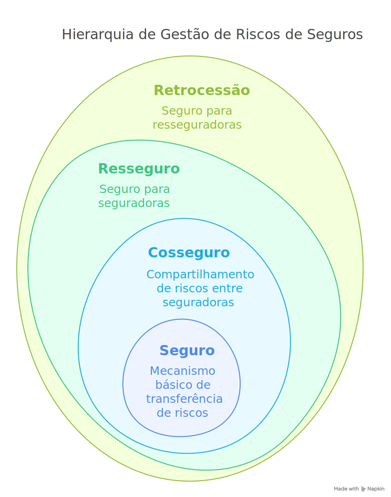
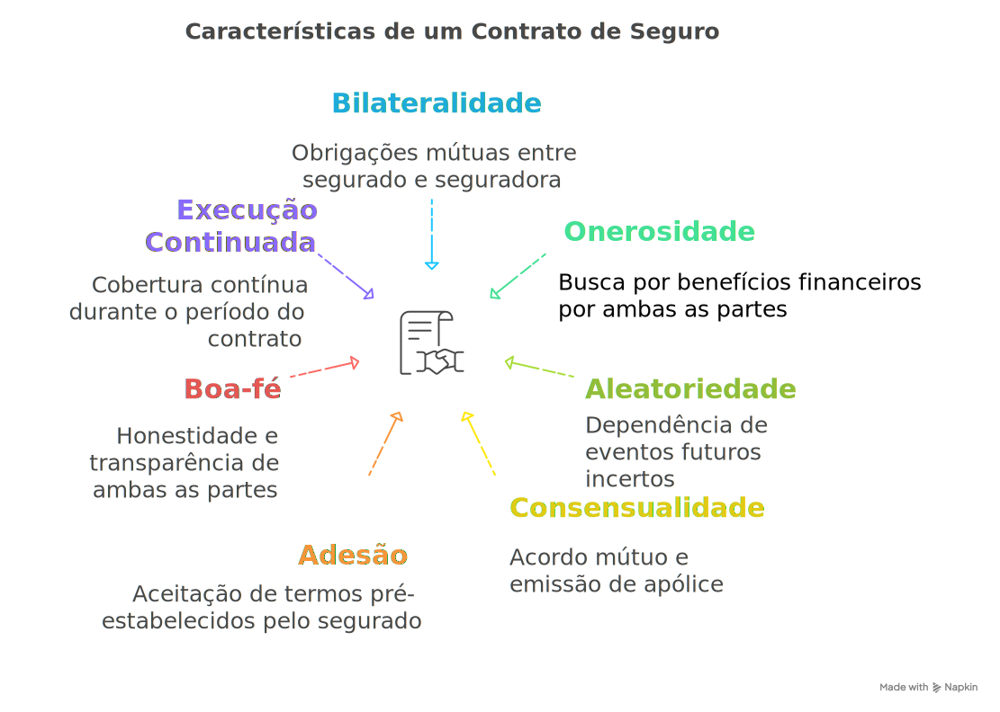

## Índice

1.  [Introdução Concisa](#introducao-concisa)
2.  [Aprofundamento Detalhado](#aprofundamento-detalhado)
    *   [2.1 Seguro](#21-seguro)
        *   [2.1.1 Conceito, Finalidade e Características](#211-conceito-finalidade-e-caracteristicas)
        *   [2.1.2 Princípios Básicos](#212-principios-basicos)
        *   [2.1.3 Seguros Facultativos e Obrigatórios](#213-seguros-facultativos-e-obrigatorios)
        *   [2.1.4 Seguro Cumulativo](#214-seguro-cumulativo)
        *   [2.1.5 Sujeitos do Contrato](#215-sujeitos-do-contrato)
        *   [2.1.6 Elementos Essenciais](#216-elementos-essenciais)
    *   [2.2 Cosseguro](#22-cosseguro)
        *   [2.2.1 Conceito, Finalidade e Características](#221-conceito-finalidade-e-caracteristicas)
    *   [2.3 Resseguro](#23-resseguro)
        *   [2.3.1 Conceito, Finalidade e Características](#231-conceito-finalidade-e-caracteristicas)
        *   [2.3.2 Contratos Automáticos e Facultativos](#232-contratos-automaticos-e-facultativos)
        *   [2.3.3 Resseguro Proporcional](#233-resseguro-proporcional)
        *   [2.3.4 Resseguro Não Proporcional](#234-resseguro-nao-proporcional)
    *   [2.4 Retrocessão](#24-retrocessao)
        *   [2.4.1 Conceito, Finalidade e Características](#241-conceito-finalidade-e-caracteristicas)
3.  [Citações de Doutrinadores](#citacoes-de-doutrinadores)
4.  [Quadros Comparativos e Práticos](#quadros-comparativos-e-praticos)
    *   [4.1 Vantagens e Limitações/Mitigação](#41-vantagens-e-limitacoesmitigacao)
    *   [4.2 Quando Utilizar / Não Utilizar](#42-quando-utilizar--nao-utilizar)
5.  [Erros Comuns, Cenário Ideal e Dicas](#erros-comuns-cenario-ideal-e-dicas)
6.  [Exemplos Práticos e Fórmulas](#exemplos-praticos-e-formulas)
    *   [6.1 Exemplo de Cosseguro](#61-exemplo-de-cosseguro)
    *   [6.2 Exemplo de Resseguro Proporcional (Quota Parte)](#62-exemplo-de-resseguro-proporcional-quota-parte)
    *   [6.3 Exemplo de Resseguro Não Proporcional (Excesso de Danos - XoL)](#63-exemplo-de-resseguro-nao-proporcional-excesso-de-danos---xol)
7.  [Mitos vs. Verdades](#mitos-vs-verdades)
8.  [Perguntas e Respostas (Q&A)](#perguntas-e-respostas-qa)
9.  [Conclusão](#conclusao)
10. [Referências Bibliográficas](#referencias-bibliograficas)

---

## Introdução Concisa

Em resumo, Seguro, Cosseguro, Resseguro e Retrocessão são mecanismos interligados de gestão e pulverização de riscos. O **Seguro** é a transferência direta do risco do segurado para uma seguradora mediante pagamento de prêmio. O **Cosseguro** é a divisão do mesmo risco entre várias seguradoras na apólice original. O **Resseguro** é o "seguro da seguradora", onde ela transfere parte dos riscos que assumiu para um ressegurador. A **Retrocessão** é o "seguro do ressegurador", onde este transfere parte dos riscos que aceitou em resseguro para outros resseguradores ou fundos especializados. Juntos, formam uma cadeia que garante a solvência do mercado e a capacidade de cobrir grandes sinistros.

---

## Aprofundamento Detalhado

O mercado de seguros opera sobre a necessidade fundamental de proteção contra eventos futuros e incertos que podem causar perdas financeiras. A complexidade e a magnitude de alguns riscos exigem mecanismos sofisticados para garantir que as promessas feitas aos segurados possam ser cumpridas. É nesse contexto que surgem as figuras do seguro, cosseguro, resseguro e retrocessão, cada uma desempenhando um papel específico na cadeia de gerenciamento de riscos.

### 2.1 Seguro

#### 2.1.1 Conceito, Finalidade e Características

**Conceito:** O seguro é um contrato pelo qual uma das partes (seguradora), mediante o recebimento de um prêmio pago pela outra parte (segurado), obriga-se a indenizá-la por prejuízos resultantes de riscos futuros, previstos no contrato, ou a pagar um capital ou renda determinados. É a base de toda a estrutura. A seguradora assume o risco que originalmente pertence ao segurado.

**Finalidade:** A principal finalidade do seguro é restabelecer o equilíbrio econômico do segurado perturbado pela ocorrência de um sinistro (evento danoso previsto no contrato). Visa a proteção contra perdas financeiras inesperadas, proporcionando segurança e tranquilidade. Também fomenta a atividade econômica, ao permitir que indivíduos e empresas assumam riscos calculados, sabendo que possuem uma rede de segurança.

**Características Gerais:**
*   **Bilateralidade:** Gera obrigações para ambas as partes (pagar prêmio vs. pagar indenização).
*   **Onerosidade:** Ambas as partes buscam vantagens patrimoniais (proteção vs. lucro/mutualismo).
*   **Aleatoriedade:** A obrigação principal da seguradora (indenizar) depende de um evento futuro e incerto (sinistro).
*   **Consensualidade:** Aperfeiçoa-se com o acordo de vontades, embora a emissão da apólice seja formalidade essencial.
*   **Adesão:** Geralmente, o segurado adere a cláusulas pré-estabelecidas pela seguradora.
*   **Boa-fé:** Exige-se a máxima boa-fé (uberrimae fidei) de ambas as partes, especialmente do segurado ao declarar o risco.
*   **Execução Continuada:** O contrato vigora por um período determinado, durante o qual a cobertura é mantida.

#### 2.1.2 Princípios Básicos

*   **Mutualismo:** A base do seguro. Os prêmios pagos por muitos formam um fundo comum (mutualidade) usado para indenizar os poucos que sofrem sinistros. A seguradora administra essa mutualidade.
*   **Máxima Boa-Fé (Uberrimae Fidei):** Ambas as partes devem agir com total honestidade e transparência. O segurado deve declarar todas as circunstâncias relevantes sobre o risco, e a seguradora deve ser clara sobre os termos da cobertura. A violação pode levar à perda do direito à indenização ou anulação do contrato.
*   **Indenização:** O seguro (especialmente o de danos) não deve ser fonte de lucro para o segurado. A indenização visa repor a perda sofrida, limitada ao valor do prejuízo e ao limite máximo de indenização (LMI) contratado. Excetuam-se os seguros de pessoas (vida, acidentes pessoais), onde os valores são pactuados previamente.
*   **Interesse Segurável:** O segurado deve ter um interesse legítimo, econômico e lícito na preservação do bem ou da pessoa segurada. Não se pode segurar algo sobre o qual não se tem interesse ou cuja perda não causaria prejuízo financeiro.
*   **Risco:** É o evento futuro e incerto, independente da vontade das partes, cuja ocorrência causa prejuízo econômico e aciona a cobertura do seguro. O risco deve ser possível, incerto, futuro, lícito e fortuito (em certa medida).
*   **Sub-rogação:** Nos seguros de danos, após pagar a indenização, a seguradora se sub-roga nos direitos e ações do segurado contra o terceiro causador do dano, até o limite do valor pago. Isso evita que o segurado receba duas vezes (da seguradora e do causador).
*   **Contribuição/Concorrência de Apólices:** Se o mesmo bem estiver segurado por mais de uma apólice contra o mesmo risco, as seguradoras contribuirão para a indenização na proporção de suas respectivas responsabilidades, respeitado o princípio indenitário (não aplicável a seguros de pessoas com valores livremente estipulados).

#### 2.1.3 Seguros Facultativos e Obrigatórios

*   **Facultativos:** A contratação depende exclusivamente da vontade das partes (ex: seguro residencial, automóvel - cobertura casco, vida individual). São a maioria no mercado.
*   **Obrigatórios:** Impostos por lei, visando proteger a sociedade ou terceiros (ex: DPVAT - Danos Pessoais Causados por Veículos Automotores de Via Terrestre, Seguro de Responsabilidade Civil do Transportador Rodoviário de Carga - RCTR-C, Seguro Garantia em licitações/contratos públicos em certos casos).

#### 2.1.4 Seguro Cumulativo

Refere-se à situação em que o mesmo interesse é segurado contra os mesmos riscos em mais de uma apólice, com o mesmo ou diferentes seguradores (Art. 782 do Código Civil). O segurado deve comunicar a existência de outras apólices aos seguradores. No seguro de danos, a soma das indenizações não pode ultrapassar o valor do bem ou do prejuízo (princípio indenitário). No seguro de pessoas, a cumulatividade é geralmente permitida sem essa limitação, podendo o beneficiário receber as indenizações de todas as apólices.

#### 2.1.5 Sujeitos do Contrato

*   **Segurador(a):** Pessoa jurídica (sociedade anônima, cooperativa ou estrangeira autorizada) legalmente constituída e autorizada pela SUSEP a operar em seguros, que assume os riscos e se obriga à indenização.
*   **Segurado:** Pessoa física ou jurídica que tem interesse direto e legítimo na conservação da coisa ou pessoa e transfere o risco ao segurador. É quem paga o prêmio (salvo estipulação em contrário).
*   **Beneficiário:** Pessoa física ou jurídica designada para receber a indenização. Pode ser o próprio segurado (na maioria dos seguros de danos) ou um terceiro (ex: seguros de vida, acidentes pessoais, responsabilidade civil).
*   **Estipulante (em seguros de grupo/coletivos):** Pessoa física ou jurídica que contrata o seguro em nome de um grupo de segurados (ex: empresa que contrata seguro de vida para funcionários). Representa os segurados perante a seguradora, mas não é o segurado.
*   **Corretor de Seguros:** Intermediário legalmente habilitado que orienta e representa o segurado (ou proponente) na contratação do seguro, buscando as melhores condições. Não é parte do contrato principal, mas tem responsabilidades importantes.

#### 2.1.6 Elementos Essenciais

*   **Garantia:** A obrigação fundamental da seguradora: cobrir o risco previsto e indenizar o prejuízo ou pagar o capital/renda em caso de sinistro.
*   **Interesse Segurável:** Vínculo lícito de valor econômico entre uma pessoa e um bem (ou outra pessoa), que faz com que a primeira sofra um prejuízo com a ocorrência do sinistro relacionado ao segundo.
*   **Risco:** O evento futuro, possível e incerto, de natureza súbita e imprevista (pelo menos quanto ao momento), cuja ocorrência gera a necessidade da prestação da seguradora. Deve ser descrito detalhadamente na apólice.
*   **Prêmio:** A contraprestação paga pelo segurado à seguradora para que esta assuma o risco. É o "preço" do seguro, calculado atuarialmente com base na probabilidade e severidade do risco, custos administrativos, impostos e margem de lucro.
*   **Empresarialidade:** A atividade seguradora é essencialmente empresarial, organizada para operar com múltiplos contratos, pulverizar riscos e gerir a mutualidade de forma técnica e profissional, visando lucro ou, no caso de cooperativas, o benefício mútuo dos associados. Exige autorização governamental (SUSEP) e cumprimento de normas rígidas de solvência.

### 2.2 Cosseguro

#### 2.2.1 Conceito, Finalidade e Características

**Conceito:** O cosseguro ocorre quando duas ou mais seguradoras, mediante um único contrato (ou contratos interligados que referenciam a mesma operação), dividem entre si, em percentuais definidos, a responsabilidade por um mesmo risco. Uma delas é designada como seguradora líder, responsável pela administração do contrato e relacionamento com o segurado, mas todas respondem diretamente perante este, na proporção de sua participação.

**Finalidade:**
*   Permitir a cobertura de riscos de grande vulto, cuja capacidade individual de uma única seguradora seria insuficiente.
*   Pulverizar o risco entre várias seguradoras já no nível primário da contratação.
*   Facilitar a gestão para o segurado, que lida principalmente com a seguradora líder.

**Características Gerais:**
*   **Divisão Direta do Risco:** O risco é compartilhado *ab initio* entre as cosseguradoras.
*   **Responsabilidade Direta:** Cada cosseguradora é diretamente responsável perante o segurado pela sua quota-parte. O segurado pode acionar cada uma delas.
*   **Seguradora Líder:** Uma das cosseguradoras (geralmente a que detém maior percentual ou que prospectou o negócio) assume a liderança administrativa, emitindo a apólice, cobrando o prêmio total (e repassando às demais) e coordenando a regulação do sinistro.
*   **Apólice Única (geralmente):** A apólice indica claramente a participação percentual de cada cosseguradora.
*   **Distinção de Resseguro:** No cosseguro, todas as seguradoras têm vínculo direto com o segurado. No resseguro, o segurado tem vínculo apenas com a seguradora direta (cedente), e esta tem um vínculo separado com o ressegurador.

### 2.3 Resseguro

#### 2.3.1 Conceito, Finalidade e Características

**Conceito:** O resseguro é a operação pela qual uma seguradora (cedente) transfere a um ressegurador (ou a vários), total ou parcialmente, um risco ou um conjunto de riscos que aceitou em seu próprio contrato de seguro, recebendo em troca uma indenização caso ocorra um sinistro nesse risco transferido. É conhecido como o "seguro das seguradoras". O contrato original de seguro entre segurado e seguradora (cedente) permanece inalterado e independente do contrato de resseguro.

**Finalidade:**
*   **Aumentar a Capacidade de Aceitação:** Permite que a seguradora aceite riscos maiores do que sua capacidade financeira individual suportaria.
*   **Estabilizar Resultados:** Protege a seguradora contra sinistros de grande vulto ou acumulação de sinistros (catástrofes), evitando flutuações drásticas em seus resultados financeiros.
*   **Pulverização Geográfica e Setorial:** Distribui os riscos geograficamente e entre diferentes ramos de seguro, reduzindo a concentração.
*   **Proteção do Patrimônio Líquido:** Garante a solvência da seguradora.
*   **Transferência de Expertise:** Resseguradores, por atuarem globalmente e com grande volume de dados, muitas vezes possuem expertise técnica e atuarial que podem ser compartilhadas com as cedentes.
*   **Arbitragem Regulatória (menos comum):** Em alguns casos, pode otimizar requisitos de capital regulatório.

**Características Gerais:**
*   **Contrato entre Seguradora e Ressegurador:** O segurado original não é parte do contrato de resseguro e, em regra, não tem relação jurídica direta com o ressegurador.
*   **Independência Contratual:** O contrato de seguro e o de resseguro são distintos. A obrigação da seguradora para com o segurado não depende do pagamento pelo ressegurador, e vice-versa (salvo cláusulas específicas como "cut-through clause", raras e reguladas).
*   **Transferência de Risco e Prêmio:** A seguradora cedente paga uma parte do prêmio original (prêmio de resseguro) ao ressegurador, que, em contrapartida, assume parte da responsabilidade pelo sinistro.
*   **Função Econômica Essencial:** Garante a estabilidade e a capacidade do mercado segurador como um todo.

#### 2.3.2 Contratos Automáticos e Facultativos

A forma como a transferência de riscos da cedente para o ressegurador ocorre define os tipos de contrato:

*   **Automáticos (Treaty Reinsurance):**
    *   **Conceito:** Contrato prévio entre cedente e ressegurador que estabelece os termos e condições sob os quais um conjunto definido de riscos (ex: todos os seguros residenciais de uma carteira, ou a parte que exceder certo limite) será automaticamente cedido pela seguradora e aceito pelo ressegurador, dentro dos limites e regras do tratado.
    *   **Características:** Obrigatoriedade mútua (cedente deve ceder, ressegurador deve aceitar, se o risco se enquadrar nos termos); Eficiência administrativa (não há análise individual de cada risco); Cobertura para uma carteira ou portfólio de riscos; Longa duração (geralmente anual, renovável).
    *   **Finalidade:** Proporcionar capacidade e proteção contínua para a carteira da seguradora de forma eficiente.

*   **Facultativos (Facultative Reinsurance):**
    *   **Conceito:** Negociação caso a caso. A seguradora oferece um risco específico (individual) ao ressegurador, que tem a faculdade (opção) de aceitá-lo ou não, e de negociar os termos (prêmio, condições) para aquele risco específico. A seguradora também tem a faculdade de oferecer ou não o risco.
    *   **Características:** Análise individual do risco; Flexibilidade para ambas as partes; Utilizado para riscos que não se enquadram nos contratos automáticos, riscos de valor muito elevado, ou riscos com características especiais; Mais oneroso administrativamente.
    *   **Finalidade:** Cobrir riscos específicos que excedem a capacidade da seguradora e/ou dos seus contratos automáticos, ou que requerem avaliação especializada.

#### 2.3.3 Resseguro Proporcional

Nesta modalidade, cedente e ressegurador compartilham prêmios e sinistros em uma proporção (percentual) predefinida. O ressegurador recebe uma fração do prêmio original e paga a mesma fração dos sinistros.

*   **Quota Parte (Quota Share):**
    *   **Conceito:** O ressegurador assume uma porcentagem fixa de *todos* os riscos de uma determinada carteira ou ramo de seguro subscrito pela cedente.
    *   **Exemplo:** Um tratado de Quota Parte de 30% para a carteira de incêndio. A seguradora cede 30% do prêmio de cada apólice de incêndio e o ressegurador paga 30% de cada sinistro dessa carteira.
    *   **Finalidade:** Aumentar capacidade geral, obter comissão de resseguro (ajuda nos custos de aquisição da cedente), proteger contra frequência e severidade.

*   **Excedente de Responsabilidade (Surplus):**
    *   **Conceito:** A seguradora define um limite de retenção (valor que ela retém para si) em cada risco individual. O valor que exceder essa retenção é cedido ao ressegurador, até um limite máximo definido no contrato. A proporção de cessão (e, portanto, de partilha de prêmios e sinistros) varia para cada risco, dependendo do seu valor total e da retenção da cedente.
    *   **Exemplo:** Retenção da cedente: `R$ 1.000.000,00`. Contrato de Excedente com capacidade para 9 "linhas" (9 vezes a retenção).
        *   Apólice de `R$ 500.000,00`: Cedente retém 100%, nada é cedido.
        *   Apólice de `R$ 3.000.000,00`: Cedente retém `R$ 1.000.000,00` (1/3). Cede `R$ 2.000.000,00` (2/3) ao ressegurador. Prêmio e sinistro são divididos: 1/3 para cedente, 2/3 para ressegurador.
        *   Apólice de `R$ 15.000.000,00`: Cedente retém `R$ 1.000.000,00`. Cede `R$ 9.000.000,00` (o máximo do contrato). Os `R$ 5.000.000,00` restantes precisariam ser colocados em outro contrato (Excedente de 2ª ordem, facultativo, etc.).
    *   **Finalidade:** Proteger a seguradora contra riscos de maior valor individual, permitindo que retenha integralmente os riscos menores e mais rentáveis.

#### 2.3.4 Resseguro Não Proporcional

Nesta modalidade, a partilha não se baseia em percentuais fixos do risco individual, mas sim no montante do sinistro. O ressegurador só responde quando o sinistro (individual ou agregado) excede um determinado valor (prioridade ou franquia), pagando o excesso até um limite contratual. O prêmio de resseguro não é uma fração direta do prêmio original, mas calculado com base na exposição do ressegurador.

*   **Excesso de Danos (Excess of Loss - XoL):**
    *   **Conceito:** Protege a seguradora contra a *severidade* de um único sinistro (ou de um evento que cause vários sinistros). O ressegurador cobre a parte da perda que excede a prioridade (franquia) da cedente, até um limite máximo por sinistro/evento. Pode ser aplicado por risco (Per Risk XL) ou por evento (Catastrophe XL).
    *   **Exemplo:** Contrato XoL: Cobertura de `R$ 5.000.000,00` em excesso de `R$ 1.000.000,00`.
        *   Sinistro de `R$ 800.000,00`: Cedente paga tudo. Ressegurador não paga nada.
        *   Sinistro de `R$ 3.000.000,00`: Cedente paga `R$ 1.000.000,00` (sua prioridade). Ressegurador paga `R$ 2.000.000,00` (o excesso).
        *   Sinistro de `R$ 7.000.000,00`: Cedente paga `R$ 1.000.000,00`. Ressegurador paga `R$ 5.000.000,00` (seu limite). O `R$ 1.000.000,00` restante fica com a cedente (ou precisa de outra camada de resseguro).
    *   **Finalidade:** Proteger contra sinistros de alto valor individual ou eventos catastróficos.

*   **Stop Loss (Excesso de Sinistralidade):**
    *   **Conceito:** Protege a seguradora contra a *frequência* ou sinistralidade *agregada* de uma carteira durante um período (geralmente um ano). O ressegurador cobre as perdas totais da carteira no período que excederem um percentual predefinido da receita de prêmios (ou um valor absoluto).
    *   **Exemplo:** Contrato Stop Loss: Cobertura ativada se a sinistralidade da carteira de Automóvel exceder 70% dos prêmios ganhos, até um limite de 100%.
        *   Prêmios Ganhos: `R$ 10.000.000,00`. Sinistralidade do ano: `R$ 6.500.000,00` (65%). Ressegurador não paga.
        *   Prêmios Ganhos: `R$ 10.000.000,00`. Sinistralidade do ano: `R$ 8.000.000,00` (80%). Prioridade da cedente: 70% = `R$ 7.000.000,00`. Ressegurador paga `R$ 1.000.000,00` (o excesso entre 80% e 70%).
        *   Prêmios Ganhos: `R$ 10.000.000,00`. Sinistralidade do ano: `R$ 11.000.000,00` (110%). Ressegurador paga `R$ 3.000.000,00` (a diferença entre 100% e 70%, pois o limite era 100%).
    *   **Finalidade:** Proteger o resultado geral da carteira contra uma acumulação inesperada de sinistros num determinado período.

*   **Catástrofe (Catastrophe Excess of Loss - Cat XL):**
    *   **Conceito:** Uma forma específica de Excesso de Danos (XoL) desenhada para cobrir perdas acumuladas decorrentes de um único grande evento catastrófico (ex: terremoto, furacão, inundação, grande incêndio industrial) que afeta múltiplos segurados da cedente simultaneamente.
    *   **Características:** Prioridades e limites muito elevados; Definição precisa do que constitui um "evento" (ex: cláusula de horas); Foco em eventos de baixa frequência e altíssima severidade.
    *   **Finalidade:** Proteger a solvência da seguradora contra eventos naturais ou causados pelo homem de grande magnitude.

### 2.4 Retrocessão

#### 2.4.1 Conceito, Finalidade e Características

**Conceito:** A retrocessão é a operação pela qual um ressegurador (retrocedente) transfere a outro ressegurador ou a um veículo de propósito específico, como fundos de investimento ligados a seguros (ILS) (retrocessionário), parte dos riscos que aceitou em resseguro. É o "resseguro do ressegurador".

**Finalidade:**
*   Permitir que o ressegurador gerencie sua própria exposição ao risco e sua capacidade.
*   Pulverizar ainda mais os riscos no mercado global.
*   Proteger o capital e a solvência do ressegurador.
*   Acessar diferentes fontes de capital (ex: mercado de capitais via ILS).

**Características:**
*   **Cadeia de Transferência:** Adiciona mais um elo na cadeia de pulverização de riscos (Segurado -> Seguradora -> Ressegurador -> Retrocessionário).
*   **Sem Vínculo com o Segurado Original:** O segurado inicial está ainda mais distante desta operação.
*   **Mercado Especializado:** O mercado de retrocessão é altamente especializado e globalizado, com poucos players de grande porte e crescente participação do mercado de capitais.
*   **Modalidades:** Pode assumir formas proporcionais ou não proporcionais, automáticas ou facultativas, similares às do resseguro.

---

## Citações de Doutrinadores

1.  **Sobre o Contrato de Seguro (Conceito e Natureza):** **J. J. Calmon de Passos** afirmava que o seguro é um contrato de suprema importância social e econômica, caracterizado pela transferência onerosa de um risco, onde a aleatoriedade é elemento central, mas mitigada pela técnica atuarial e pelo mutualismo que fundamentam a operação da seguradora.
2.  **Sobre o Princípio da Máxima Boa-Fé:** **Ernesto Tzirulnik, Flávio de Queiroz B. Cavalcanti e Ayrton Pimentel** (em "O Contrato de Seguro de Acordo com o Novo Código Civil Brasileiro") enfatizam que a *uberrimae fidei* é mais intensa no seguro do que em outros contratos, exigindo do segurado uma declaração absolutamente verídica e completa do risco, sob pena de perda da garantia. A seguradora, por sua vez, deve ser transparente nas condições.
3.  **Sobre o Resseguro (Finalidade):** **Pedro Alvim** (em "O Contrato de Seguro") destacava que o resseguro não é apenas uma conveniência, mas uma necessidade técnica e econômica para as seguradoras, permitindo-lhes aceitar operações de maior vulto, garantir o equilíbrio de suas carteiras e proteger seu patrimônio contra grandes catástrofes, assegurando a solvência do sistema.
4.  **Sobre a Diferença entre Cosseguro e Resseguro:** **Ricardo Bechara Santos** (jurista e atuário) frequentemente esclarece que no cosseguro há uma pluralidade de seguradores diretos na mesma apólice, todos com vínculo jurídico primário com o segurado, enquanto no resseguro, o contrato é autônomo, entre seguradora (cedente) e ressegurador, sem relação direta com o segurado original. A natureza do vínculo jurídico é a chave da distinção.
5.  **Sobre o Resseguro Não Proporcional (Função):** Autores internacionais como **Hansjörg Albrecher e colegas** (em "Reinsurance: Actuarial and Statistical Aspects") explicam que os métodos não proporcionais (como XoL e Stop Loss) são ferramentas essenciais para gerenciar a volatilidade dos resultados das seguradoras, focando na proteção contra a severidade dos sinistros (individuais ou agregados) em vez de uma partilha proporcional do negócio como um todo.

---

## Quadros Comparativos e Práticos

### 4.1 Vantagens e Limitações/Mitigação

| Item         | Vantagens                                                                                                    | Limitações / Como Mitigar                                                                                                                               |
| :----------- | :----------------------------------------------------------------------------------------------------------- | :------------------------------------------------------------------------------------------------------------------------------------------------------ |
| **Seguro**   | Transferência direta do risco; Proteção financeira; Tranquilidade; Base para outras operações.               | Custo (prêmio); Exclusões de cobertura; Moral hazard (descuido); Seleção Adversa. **Mitigação:** Análise de risco, franquias, limites, boa-fé, regulação. |
| **Cosseguro** | Aumenta capacidade para riscos grandes; Pulverização na origem; Segurado lida com líder (simplifica).        | Complexidade na emissão e regulação (várias partes); Possíveis divergências entre cosseguradoras. **Mitigação:** Cláusulas claras, liderança forte.       |
| **Resseguro** | Amplia capacidade da seguradora; Estabiliza resultados; Protege solvência; Pulveriza riscos globalmente.    | Custo para a cedente; Risco de crédito do ressegurador; Complexidade contratual. **Mitigação:** Diversificação de resseguradores, análise de rating, garantias. |
| **Retrocessão** | Pulverização adicional para resseguradores; Acesso a capital alternativo (ILS); Gerenciamento de exposição. | Disponibilidade e custo podem flutuar (mercado cíclico); Risco de crédito do retrocessionário. **Mitigação:** Diversificação, colateralização (ILS).          |

### 4.2 Quando Utilizar / Não Utilizar

| Operação                     | Quando Utilizar                                                                                                                                 | Porque Utilizar                                                                                                  | Quando Não é Recomendado / Motivos                                                                                                          |
| :--------------------------- | :---------------------------------------------------------------------------------------------------------------------------------------------- | :---------------------------------------------------------------------------------------------------------------- | :------------------------------------------------------------------------------------------------------------------------------------------ |
| **Seguro**                   | Para transferir riscos individuais ou empresariais que podem causar perdas financeiras significativas e são seguráveis.                         | Proteção financeira, cumprimento de obrigações legais/contratuais, viabilização de atividades econômicas.        | Riscos não seguráveis (especulativos, desgaste natural, ilegais); Riscos de baixo impacto financeiro (autossseguro pode ser mais eficiente). |
| **Cosseguro**                | Riscos de valor muito elevado que excedem a capacidade ou o apetite de uma única seguradora no mercado local/direto.                             | Dividir a responsabilidade primária, manter o risco no mercado direto (sem ir direto para resseguro).               | Riscos de pequeno ou médio porte (burocracia desnecessária); Falta de acordo entre seguradoras sobre termos ou liderança.                    |
| **Resseguro Automático**     | Para proteger carteiras inteiras de riscos de forma eficiente e contínua, garantindo capacidade e estabilidade ao longo do tempo.               | Eficiência operacional, garantia de capacidade, proteção regular contra frequência e/ou severidade moderada.   | Riscos muito específicos, atípicos ou de valor excepcional que não se encaixam nos parâmetros do tratado (usar facultativo).                 |
| **Resseguro Facultativo**    | Riscos individuais de alto valor, complexos, atípicos, ou que excedem a capacidade dos tratados automáticos.                                     | Flexibilidade, análise detalhada do risco, cobertura para situações excepcionais.                                | Para gestão de carteiras homogêneas (ineficiente); Riscos pequenos e padronizados (custo administrativo alto).                             |
| **Resseguro Proporcional**   | Aumentar capacidade geral, obter comissão de resseguro (ajuda fluxo caixa da cedente), compartilhar resultados (bons e ruins) com ressegurador. | Alinhamento de interesses (partilha proporcional), suporte financeiro via comissão.                             | Quando a principal preocupação é proteger-se apenas contra grandes sinistros isolados ou catástrofes (XoL é mais direto).                   |
| **Resseguro Não Proporcional** | Proteger a seguradora contra sinistros de alta severidade (XoL, Cat XL) ou contra a volatilidade da sinistralidade agregada (Stop Loss).      | Foco na proteção do "bottom line" e solvência contra eventos extremos, sem ceder negócios lucrativos de baixo risco. | Quando se busca alívio de capital significativo ou comissões elevadas (Proporcional pode ser melhor).                                      |
| **Retrocessão**              | Quando um ressegurador precisa gerenciar sua própria concentração de riscos, proteger seu capital ou otimizar sua carteira.                     | Pulverização adicional, gestão de capital do ressegurador, acesso a mercados globais de risco.                   | Riscos pequenos que o ressegurador pode reter confortavelmente; Custo proibitivo no mercado de retrocessão.                                |

---

## Erros Comuns, Cenário Ideal e Dicas

*   **Erros Comuns:**
    *   Confundir Cosseguro com Resseguro (principalmente a relação com o segurado).
    *   Achar que o segurado pode acionar o ressegurador diretamente (regra geral é não poder).
    *   Pensar que Resseguro Proporcional e Não Proporcional servem exatamente para os mesmos fins.
    *   Ignorar o papel da seguradora líder no Cosseguro.
    *   Não entender a diferença entre Quota Parte (percentual fixo de tudo) e Excedente (percentual variável acima da retenção).
    *   Confundir Excesso de Danos (XoL - foca na severidade de um sinistro/evento) com Stop Loss (foca na sinistralidade agregada da carteira no ano).
    *   Achar que Retrocessão é apenas um "resseguro normal" (é um mercado mais específico, com players e dinâmicas próprias).

*   **Cenário Ideal de Uso:**
    *   Uma grande indústria contrata um seguro patrimonial de `R$ 500 milhões`.
    *   A Seguradora A aceita o risco, mas sua capacidade de retenção é de `R$ 50 milhões`.
    *   Ela estrutura a operação:
        *   **Cosseguro:** Convida as Seguradoras B e C. A fica com 40% (`R$ 200M`), B com 30% (`R$ 150M`) e C com 30% (`R$ 150M`). A é a líder.
        *   **Resseguro:**
            *   A Seguradora A (líder) retém `R$ 50M` de sua parte (`R$ 200M`). Coloca os `R$ 150M` excedentes em resseguro. Pode usar:
                *   Um contrato de Excedente de Responsabilidade (automático).
                *   Camadas de Excesso de Danos (XoL) para proteger sua retenção de `R$ 50M` contra um único grande sinistro.
                *   Resseguro Facultativo para colocar partes que não couberam nos automáticos ou para riscos específicos.
            *   As Seguradoras B e C fazem o mesmo com suas participações.
        *   **Retrocessão:** Os resseguradores que aceitaram partes dos `R$ 150M` da Seguradora A (ou das outras) podem, por sua vez, ceder uma porção desse risco a outros resseguradores (retrocessionários) para gerenciar suas próprias exposições.

*   **Dicas para Ganhar Tempo em Provas:**
    *   **Palavra-chave:** Associe "Cosseguro" a "divisão na origem/apólice única/várias seguradoras diretas".
    *   **Palavra-chave:** Associe "Resseguro" a "seguro da seguradora/contrato separado/cedente".
    *   **Palavra-chave:** Associe "Retrocessão" a "resseguro do ressegurador".
    *   **Diferença Crucial:** Foco no **vínculo jurídico** com o segurado original (só existe no Seguro e Cosseguro).
    *   **Proporcional vs. Não Proporcional:** Proporcional = % fixo (Quota) ou variável (Excedente) de **cada apólice/prêmio**. Não Proporcional = entra em ação **acima de um valor de sinistro** (XoL, Cat XL) ou **sinistralidade total** (Stop Loss).
    *   **Memorize as siglas:** XoL (Excess of Loss), Cat XL (Catastrophe XL).
    *   Entenda a lógica da cadeia: Risco original -> Seguro -> (Cosseguro opcional) -> Resseguro -> Retrocessão.

---

## Exemplos Práticos e Fórmulas

### 6.1 Exemplo de Cosseguro

*   **Situação:** Uma plataforma de petróleo (valor `R$ 1 Bilhão`) precisa de seguro.
*   **Estrutura:** Nenhuma seguradora local assume sozinha. A Seguradora Líder (L) aceita o risco e organiza um cosseguro:
    *   Líder (L): 40% (`R$ 400 Milhões`)
    *   Cosseguradora 1 (C1): 30% (`R$ 300 Milhões`)
    *   Cosseguradora 2 (C2): 20% (`R$ 200 Milhões`)
    *   Cosseguradora 3 (C3): 10% (`R$ 100 Milhões`)
*   **Prêmio:** Se o prêmio total for `R$ 10 Milhões`, L recebe `R$ 4M`, C1 `R$ 3M`, C2 `R$ 2M`, C3 `R$ 1M` (L geralmente arrecada e repassa).
*   **Sinistro:** Ocorre um sinistro de `R$ 50 Milhões`.
    *   L paga: 40% de `R$ 50M` = `R$ 20 Milhões`
    *   C1 paga: 30% de `R$ 50M` = `R$ 15 Milhões`
    *   C2 paga: 20% de `R$ 50M` = `R$ 10 Milhões`
    *   C3 paga: 10% de `R$ 50M` = `R$ 5 Milhões`
*   **Comentário:** O segurado pode cobrar de cada cosseguradora sua parte. A Líder coordena a regulação.

### 6.2 Exemplo de Resseguro Proporcional (Quota Parte)

*   **Situação:** Seguradora A tem um tratado de Quota Parte de 40% com o Ressegurador R para sua carteira de Seguro Residencial.
*   **Apólice:** A Seguradora A emite uma apólice residencial com Importância Segurada (IS) de `R$ 500.000,00` e Prêmio de `R$ 1.000,00`.
*   **Cessão:**
    *   A Seguradora A cede 40% da IS para R: `R$ 200.000,00`. Retém 60%: `R$ 300.000,00`.
    *   A Seguradora A cede 40% do Prêmio para R: `R$ 400,00`. Retém `R$ 600,00`.
    *   Geralmente, R paga uma comissão de resseguro para A sobre o prêmio cedido (ex: 25% de `R$ 400,00` = `R$ 100,00`).
*   **Sinistro:** Ocorre um sinistro total (`R$ 500.000,00`).
    *   Seguradora A paga os `R$ 500.000,00` ao segurado.
    *   Ressegurador R reembolsa 40% para A: `R$ 200.000,00`.
    *   Custo líquido para A: `R$ 300.000,00`. Custo para R: `R$ 200.000,00`.
*   **Fórmula (Quota Parte):**
    *   `Prêmio Cedido = Prêmio Original * % Quota`
    *   `Sinistro Recuperado = Sinistro Total * % Quota`
    *   `Responsabilidade Cedida = IS Original * % Quota`

### 6.3 Exemplo de Resseguro Não Proporcional (Excesso de Danos - XoL)

*   **Situação:** Seguradora B tem um contrato de resseguro XoL para sua carteira de RC Geral (Responsabilidade Civil Geral).
*   **Estrutura do Contrato XoL:** Cobertura de `R$ 4.000.000,00` em excesso de `R$ 1.000.000,00` por sinistro. (Notação comum: `R$ 4M xs R$ 1M`).
*   **Prêmio de Resseguro:** Calculado atuarialmente (não é % direto do prêmio original), digamos que seja `R$ 150.000,00` por ano.
*   **Sinistro 1:** Ocorre um sinistro de RC de `R$ 700.000,00`.
    *   Valor do sinistro (`R$ 700k`) é menor que a prioridade (`R$ 1M`).
    *   Seguradora B paga `R$ 700.000,00` ao terceiro prejudicado.
    *   Ressegurador não paga nada.
*   **Sinistro 2:** Ocorre um sinistro de RC de `R$ 3.500.000,00`.
    *   Valor do sinistro (`R$ 3.5M`) excede a prioridade (`R$ 1M`).
    *   Seguradora B paga os primeiros `R$ 1.000.000,00` (sua retenção/prioridade).
    *   Ressegurador paga o excesso: `R$ 3.500.000,00 - R$ 1.000.000,00 = R$ 2.500.000,00`.
    *   A cobertura do ressegurador (`R$ 4M`) não foi excedida.
*   **Sinistro 3:** Ocorre um sinistro de RC de `R$ 10.000.000,00`.
    *   Valor do sinistro (`R$ 10M`) excede a prioridade (`R$ 1M`) e a cobertura do resseguro (`R$ 1M + R$ 4M = R$ 5M`).
    *   Seguradora B paga os primeiros `R$ 1.000.000,00`.
    *   Ressegurador paga o limite máximo de sua camada: `R$ 4.000.000,00`.
    *   Os `R$ 5.000.000,00` restantes (`R$ 10M - R$ 1M - R$ 4M`) ficam a cargo da Seguradora B (ou de uma camada superior de resseguro XoL, se houver).
*   **Fórmula (XoL Simples):**
    *   `Recuperação do Ressegurador = Max(0, Min(Sinistro Total - Prioridade, Limite da Camada XoL))`
    *   `Custo para Cedente = Sinistro Total - Recuperação do Ressegurador`

---

## Mitos vs. Verdades

| Mito / Concepção Errada                                                                | Verdade                                                                                                                                    | Citação / Explicação Doutrinária                                                                                                                                                                                                                                                                                                                              |
| :------------------------------------------------------------------------------------- | :----------------------------------------------------------------------------------------------------------------------------------------- | :------------------------------------------------------------------------------------------------------------------------------------------------------------------------------------------------------------------------------------------------------------------------------------------------------------------------------------------------------------ |
| 1. Cosseguro e Resseguro são a mesma coisa, só muda o nome.                             | São operações distintas com naturezas jurídicas diferentes. Cosseguro é divisão primária; Resseguro é transferência secundária.             | **Ricardo Bechara Santos:** "No cosseguro, há pluralidade de vínculos diretos segurador-segurado na mesma apólice. No resseguro, o vínculo é segurador-ressegurador, contrato autônomo, o segurado não é parte." (paráfrase de seus ensinamentos sobre a distinção fundamental).                                                                                |
| 2. Se a minha seguradora tiver resseguro, posso cobrar direto do ressegurador se ela falir. | Regra geral: Não. O contrato de resseguro é entre seguradora e ressegurador (*res inter alios acta*). O segurado não é parte.           | **Código Civil, Art. 788 (interpretado a contrario sensu para resseguro):** Embora fale do seguro, a lógica da relatividade dos contratos se aplica. **Pedro Alvim:** Salvo cláusulas específicas e raras (como cut-through, de validade discutível em alguns sistemas), o resseguro não cria vínculo direto entre ressegurador e segurado original.              |
| 3. O Ressegurador sempre participa de todos os sinistros da apólice ressegurada.         | Falso. Depende do tipo de resseguro. Em XoL, só participa se o sinistro exceder a prioridade. Em Quota Parte, sim, participa de todos. | **Doutrina Geral de Resseguro:** Resseguro Proporcional implica partilha desde o primeiro real de sinistro (na proporção). Resseguro Não Proporcional só é acionado acima de um patamar de perda (prioridade), focando em severidade ou agregação.                                                                                                           |
| 4. Contratar seguro com uma seguradora que usa muito resseguro é mais arriscado.         | Geralmente o oposto. O uso adequado de resseguro aumenta a capacidade e a solvência da seguradora, tornando-a mais segura.               | **SUSEP / Práticas de Supervisão:** A regulação exige que as seguradoras mantenham níveis adequados de solvência, e o resseguro é uma ferramenta chave para isso. Um bom programa de resseguro é sinal de gestão prudente do risco.                                                                                                                               |
| 5. Resseguro só serve para riscos gigantescos como plataformas de petróleo ou aviões.    | Falso. Resseguro é usado em diversas carteiras, incluindo automóvel, residencial, vida, para gerenciar capacidade, estabilizar resultados e proteger contra acumulações (ex: Stop Loss em auto, Cat XL para vendavais/granizo em residencial). | **Manuais de Resseguro (ex: Swiss Re, Munich Re):** Demonstram a ampla aplicabilidade do resseguro em quase todos os ramos, seja para capacidade (linhas grandes), seja para volatilidade (XoL, Stop Loss), seja para catástrofe (Cat XL).                                                                                                                          |

---

## Perguntas e Respostas (Q&A)

**P1: Qual a diferença fundamental entre Seguro Cumulativo e Cosseguro?**
*   **R:** No **Seguro Cumulativo**, o segurado contrata *múltiplas apólices* (com uma ou várias seguradoras) para cobrir o *mesmo interesse* contra os *mesmos riscos*. A responsabilidade de cada seguradora é independente, mas no seguro de danos, a soma das indenizações não pode exceder o prejuízo. No **Cosseguro**, há uma *única apólice* (ou conjunto interligado) onde *várias seguradoras* dividem, desde o início, a responsabilidade por um único risco em percentuais definidos, respondendo diretamente ao segurado por sua quota.

**P2: Uma seguradora pode usar Resseguro Automático e Facultativo ao mesmo tempo? Para quê?**
*   **R:** Sim. É muito comum. O **Automático** (tratado) cobre a maior parte da carteira de forma eficiente (ex: todos os riscos até `R$ 5M`). Riscos que *excedam* a capacidade do tratado (ex: um risco de `R$ 10M`) ou que sejam *excluídos* do tratado (ex: um tipo de ocupação específica) precisam ser colocados via **Facultativo**, negociando caso a caso. Um complementa o outro.

**P3: No Resseguro de Excedente de Responsabilidade, como se calcula a divisão de prêmio e sinistro?**
*   **R:** A divisão é proporcional à responsabilidade assumida. Se a retenção da cedente é `R` e o Limite Máximo de Indenização (LMI) da apólice é `LMI`, e o contrato de excedente cobre o valor `C` (cedido ao ressegurador), onde `LMI = R + C`. A proporção da cedente é `R / LMI` e a do ressegurador é `C / LMI`. O prêmio original e qualquer sinistro serão divididos nessas proporções. Ex: Retenção `R=1M`, LMI=`3M`. Então `C=2M`. Cedente fica com 1/3, Ressegurador com 2/3 do prêmio e do sinistro.

**P4: O que impede uma seguradora de reter 0% de um risco e ceder 100% em resseguro?**
*   **R:** A regulação (SUSEP) e a prática de mercado. Geralmente exige-se uma retenção mínima para garantir que a seguradora tenha "pele em jogo" (*skin in the game*), incentivando uma boa subscrição inicial do risco. Além disso, resseguradores podem ser relutantes em aceitar 100% de cessão (cessão "de fachada" ou *fronting*), pois preferem que a cedente compartilhe o risco. O *fronting* existe, mas é regulado e específico para certas situações (ex: multinacionais precisando de apólice local).

**P5: Retrocessão é sempre feita entre resseguradores tradicionais?**
*   **R:** Não necessariamente. Embora o mercado tradicional de retrocessão envolva resseguradores cedendo riscos para outros resseguradores, há uma participação crescente do mercado de capitais através dos *Insurance-Linked Securities* (ILS), como *Cat Bonds* (Títulos de Catástrofe) e veículos colateralizados, onde investidores institucionais assumem riscos de (res)seguro em troca de prêmios/retornos.

---

## Conclusão

Compreender a intrincada rede formada pelo seguro, cosseguro, resseguro e retrocessão é fundamental não apenas para profissionais do setor, mas para qualquer pessoa que deseje entender a gestão de riscos em larga escala e a estabilidade do sistema financeiro. O **seguro** é a base, a transferência inicial do risco individual ou empresarial. O **cosseguro** atua como uma ferramenta de divisão primária para riscos que excedem a capacidade individual no mercado direto. O **resseguro**, em suas variadas formas (automático/facultativo, proporcional/não proporcional), é o pilar que sustenta a capacidade e a solvência das seguradoras, permitindo-lhes operar com segurança e aceitar desafios maiores, absorvendo choques de grandes sinistros e catástrofes. Por fim, a **retrocessão** adiciona uma camada final de pulverização e gestão de capital para os próprios resseguradores, conectando o risco até mesmo ao mercado de capitais global.

Dominar esses conceitos, suas diferenças, finalidades, vantagens e limitações, bem como as nuances de cada modalidade contratual, é crucial para a atuação no mercado regulado pela SUSEP. A aplicação correta desses mecanismos não é apenas uma questão técnica ou contratual, mas sim um elemento essencial para a saúde econômica do setor segurador e, por extensão, da economia como um todo, garantindo que as promessas de proteção financeira feitas aos segurados possam ser cumpridas mesmo diante dos eventos mais adversos. A análise crítica das estruturas de transferência de risco, o entendimento das motivações de cada parte e a capacidade de identificar a ferramenta adequada para cada situação são habilidades indispensáveis para o futuro regulador ou profissional da área.

---

## Referências Bibliográficas

1.  TZIRULNIK, Ernesto; CAVALCANTI, Flávio de Queiroz B.; PIMENTEL, Ayrton. *O Contrato de Seguro: de acordo com o novo Código Civil brasileiro*. 3. ed. São Paulo: Editora Revista dos Tribunais, 2013.
2.  ALVIM, Pedro. *O Contrato de Seguro*. 3. ed. Rio de Janeiro: Forense, 2007.
3.  SANTOS, Ricardo Bechara. *Direito de Seguro no Novo Código Civil e Legislação Própria*. Rio de Janeiro: Forense, 2006.
4.  BRASIL. *Lei nº 10.406, de 10 de janeiro de 2002*. Institui o Código Civil. (Artigos 757 a 802 - Do Contrato de Seguro).
5.  BRASIL. *Lei Complementar nº 126, de 15 de janeiro de 2007*. Dispõe sobre a política de resseguro, retrocessão e sua intermediação, as operações de cosseguro (...)
6.  SUSEP - Superintendência de Seguros Privados. *Circulares e Resoluções* pertinentes a operações de seguro, cosseguro, resseguro e retrocessão. (Consultar site da SUSEP para normas atualizadas).
7.  GERATHEWOHL, Klaus. *Reinsurance: Principles and Practice*. Vol. I e II. Karlsruhe: Verlag Versicherungswirtschaft, 1980. (Obra clássica internacional, embora antiga, os princípios são válidos).
8.  SWISS RE. *Publications and Risk Insights*. (O site da Swiss Re e outras grandes resseguradoras como Munich Re, SCOR, oferecem vasto material educativo sobre resseguro).
9.  ALBRECHER, Hansjörg; BEIRLANT, Jan; HAASTERS, Jef L. Teugels. *Reinsurance: Actuarial and Statistical Aspects*. Wiley Series in Probability and Statistics. Chichester: Wiley, 2017.
10. CARTER, Robert L. *Reinsurance*. 4th ed. London: Kluwer Publishing, 1995. (Referência importante sobre práticas de resseguro).