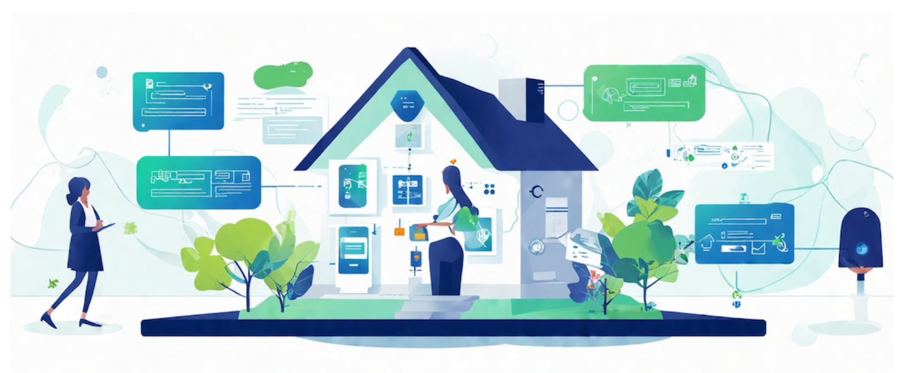

The traditional process of applying for a mortgage loan can be a complex and time-consuming endeavor. Prospective
homebuyers often find themselves navigating through a maze of paperwork, policies, and procedures, leaving them with
numerous questions and uncertainties. However, with the advent of generative AI agents, this process can be streamlined
and transformed into a more user-friendly experience. Imagine a virtual assistant that can guide you through every step,
answering your questions, and even assisting with tasks on your behalf, making the mortgage application process more
efficient and less daunting.

In this workshop, attendees will learn how to harness the power of Amazon Bedrock Knowledge Base, Agents, and Flows to
create a comprehensive solution for the mortgage application process. They will start by building a Knowledge Base that
houses all the relevant information, policies, and procedures related to mortgage loans. This Knowledge Base will serve
as a centralized repository, allowing end-users to ask questions such as "What is the policy around lead paint in
homes?" or "What are the documentation requirements for self-employed borrowers?" and receive accurate and up-to-date
responses.

Next, they will develop an intelligent agent capable of understanding natural language queries and providing accurate
responses from the Knowledge Base. Additionally, attendees will explore the capabilities of Agents to perform tasks on
behalf of the end-user, such as analyzing a property listed on the Multiple Listing Service (MLS) and determining if the
end-user can afford it based on their financial situation. Agents can also initiate application processes, gather
necessary documents, or even interact with external systems to streamline the mortgage application journey.

Furthermore, attendees will create a Flow that orchestrates the entire workflow, guiding the end-user through each step
of the mortgage application process seamlessly. This Flow will act as a conversational interface, allowing end-users to
interact with the Knowledge Base, Agents, and other integrated systems through natural language. Attendees will learn
how to stitch together the generative AI pieces they've built, creating a cohesive and user-friendly experience that can
be integrated into existing mortgage processing applications or platforms.

While this workshop focuses on the mortgage application use case, the possibilities for future exploration are vast.
Attendees can envision extending this solution to other areas of the financial services industry, such as personal
banking, investment advisory, or insurance claims processing. Additionally, they can explore integrating this solution
with existing customer relationship management (CRM) systems or other enterprise applications, creating a unified and
intelligent platform for customer interactions. The potential for leveraging generative AI in streamlining complex
processes and enhancing customer experiences is boundless, and this workshop serves as a stepping stone towards
unlocking that potential.

Let's dive in!

Duration
This workshop will take approximately 2-4 hours to complete.

Clean-up
If you are running this on your own AWS Account please follow the instructions in the clean-up section